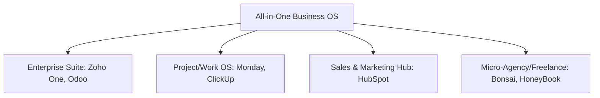

# 📊 Competitor Analysis & Strategic Expansion Roadmap
## AlphaClone Business OS vs. The Market Leaders

This document provides a comprehensive, engineering-grade competitive analysis comparing **AlphaClone Business OS** against the dominant all-in-one business management systems in the industry. It details our current architectural strengths, highlights our critical weaknesses, lists specific features to copy/add from competitors, and outlines an actionable improvement plan—**without introducing new code at this stage**.

---

## 1. The Competitive Landscape: Profiles & Market Positions

To build the best all-in-one business operating system, we must benchmark against the distinct categories of competitors:



### 1.1 Zoho One (The Aggregated Suite)
* **What it is**: A suite of 45+ integrated SaaS applications covering CRM, Mail, Books (accounting), Projects, campaigns, sign, and custom low-code tools.
* **🟢 Strengths**:
  * **Unrivaled Breadth**: Covers everything from HR (Zoho People) and IT support (Zoho Desk) to complex double-entry accounting (Zoho Books).
  * **Affordability**: Extremely cost-effective for small-to-medium teams looking for a complete suite.
  * **Global Compliance**: Handles multiple currencies, tax codes, and regional hosting constraints.
* **🔴 Weaknesses**:
  * **Siloed Experience**: The tools feel like separate acquisitions glued together. UI/UX is highly inconsistent.
  * **Complex Scripting**: Custom workflows require "Deluge," Zoho's proprietary, high-friction programming language.
  * **Performance**: Pages can be slow, bloated, and require navigating between multiple browser tabs.

### 1.2 Odoo (The Modular Open-Source ERP)
* **What it is**: An open-source, highly modular system where users install "apps" (CRM, Invoicing, Inventory, Manufacturing, eCommerce) on top of a single database.
* **🟢 Strengths**:
  * **Single Source of Truth**: All modules share a unified PostgreSQL database, eliminating data sync delay.
  * **Infinite Customizability**: Being open-source, developers can modify any portion of the backend (Python).
  * **Modular Scalability**: Start with just a CRM; turn on inventory or manufacturing when needed.
* **🔴 Weaknesses**:
  * **Deployment Complexity**: Setting up, maintaining, and scaling self-hosted Odoo is difficult.
  * **Costly Enterprise Licensing**: The paid tier and official hosting can become expensive quickly.
  * **Aesthetics**: UI is dry, clinical, and lacks a modern, premium SaaS feel.

### 1.3 Monday.com (The Work OS)
* **What it is**: A visual project manager that evolved into a customizable "Work OS" with CRM, Dev, and Service workflows.
* **🟢 Strengths**:
  * **World-Class UI/UX**: Colorful, modern, highly interactive, and fast.
  * **No-Code Automation**: Extremely intuitive, natural-language workflow builder ("When status changes to X, notify Y").
  * **Collaborative Docs**: Monday Workdocs allow real-time collaborative typing directly connected to board data.
* **🔴 Weaknesses**:
  * **Shallow Core Features**: The CRM is essentially just a customized spreadsheet—lacks deep email tracking, deal scoring, or quoting.
  * **No Native Finance/Billing**: Lacks invoicing ledgers, expense tracking, and payment processing (must integrate with third-party tools like Stripe or QuickBooks).

### 1.4 ClickUp (The Feature-Dense Aggregator)
* **What it is**: The "one app to replace them all" targeting task management, docs, chat, whiteboards, and simple CRM.
* **🟢 Strengths**:
  * **Feature Density**: Offers time-tracking, whiteboards, document management, and chat in the base package.
  * **Hierarchy Control**: Workspaces -> Spaces -> Folders -> Lists -> Tasks allows management of massive organizations.
* **🔴 Weaknesses**:
  * **Severe Bloat & Bugs**: Trying to do everything has led to a highly complex, buggy interface.
  * **Performance Bottlenecks**: High memory usage and slow page transitions are common complaints.
  * **Surface-Level CRM**: Cannot handle complex pipelines or sales forecasting.

### 1.5 HubSpot (The Sales & Marketing Powerhouse)
* **What it is**: The industry standard for inbound marketing, CRM, sales pipeline, and client communication.
* **🟢 Strengths**:
  * **Contact Tracking**: Automatically logs every email sent/received, page visit, and form submission on a unified timeline.
  * **Marketing Automation**: Visual email drip-campaign sequences and lead-scoring engines are top-tier.
  * **Client Portal & Document Tracking**: Share proposals, track exactly when a client views them and on what page, and let them book meetings directly on your calendar.
* **🔴 Weaknesses**:
  * **Exorbitant Cost**: Pricing escalates aggressively as your contact database or team scales.
  * **Weak PM capabilities**: Project management is rudimentary and treated as a minor add-on.

### 1.6 Bonsai & HoneyBook (The Client Portal Specialists)
* **What it is**: All-in-one management tools specifically tailored for freelancers, agencies, and professional services.
* **🟢 Strengths**:
  * **Client Experience**: Focuses heavily on the onboarding flow (Proposal -> Contract -> Invoice -> Payment -> Project Kickoff).
  * **Beautiful Templates**: Pre-built, legally vetted contracts, interactive questionnaires, and invoicing designs.
* **🔴 Weaknesses**:
  * **Single-Tenant Focus**: Built for solo operators or tiny teams.
  * **Limited Scale**: Cannot handle complex event automation, custom plugin extensions, or heavy team task-collaboration.

---

## 2. Benchmarking AlphaClone: Strengths vs. Weaknesses

Based on our current code audits (including `SYSTEMS_ROADMAP_TO_100_PERCENT.md`, `BUSINESS_OS_SUMMARY.md`, and `ZOHO_INTEGRATION_AUDIT.md`), here is how AlphaClone ranks.

### 2.1 Our Core Strengths (Where We Win)

1. **Intelligent Event-Driven Architecture (The Event Bus)**
   * **Our Advantage**: Our core is built on a real-time event bus (`events`, `event_logs`) utilizing Supabase Realtime. Unlike Monday.com or ClickUp, which rely on polling or heavy middleware, our systems react instantly to database state changes.
2. **Multi-Tenant Plugin System**
   * **Our Advantage**: We have a mature plugin framework (`plugins`, `tenant_plugins`, `plugin_hooks`). Businesses can toggle integrations (Slack, Stripe, Google Calendar) on/off, mimicking Odoo's modularity but with modern, isolated SaaS architecture.
3. **Built-in AI Predictive Insights**
   * **Our Advantage**: Our AI Core goes beyond standard integrations. It generates proactive actions, calculates ground truth confidence scores, tracks "Momentum Streaks" (gamification), and performs sentiment analysis on emails.
4. **Data Isolation (RLS)**
   * **Our Advantage**: Strong, multi-tenant Postgres Row Level Security (RLS) ensures absolute data privacy between businesses out of the box.
5. **Cost-to-Value Ratio**: Offering CRM, Invoicing, Project Management, and Video Meetings at a lower price point ($45/mo) than purchasing HubSpot ($90+/mo) + QuickBooks ($35/mo) + Asana ($15/mo) combined.

---

### 2.2 Our Critical Weaknesses (Where We Fail)

1. **Mocked/Simulated Lead Generation**
   * **Our Weakness**: The Lead Finder UI looks professional, but the backend uses simulated/placeholder scraping. We do not fetch real, validated leads, which undermines the core value proposition.
2. **Siloed and Incomplete UI**
   * **Our Weakness**: While our backend services for email campaigns, quotes/proposals, and workflows are highly sophisticated, **the UI is missing or incomplete**. Users cannot build email campaigns visually, customize workflows, or manage custom fields without writing database queries.
3. **Fragile and Isolated Integrations**
   * **Our Weakness**: Our email integrations are fragmented. Gmail is hardcoded, and the Zoho integration suffers from critical 401 token refresh failures, lacks rate-limiting protection, stores tokens with a fallback encryption key in git, and operates on an isolated route rather than inside a unified inbox.
4. **Lack of Double-Entry Ledger Sync**
   * **Our Weakness**: We track invoices and payments, but we lack a true general ledger system like Zoho Books or QuickBooks, making tax planning and deep financial auditing impossible.
5. **No Collaborative Workspace**
   * **Our Weakness**: We have project tasks and chat, but no shared whiteboards, real-time cursor presence, or document editors like Monday or ClickUp.

---

## 3. What to Copy: Feature-by-Feature Specs to Defeat Competitors

To make AlphaClone the undisputed best-in-class Business OS, we must steal the best features from our competitors and integrate them into our event-driven database.

### 3.1 From HubSpot: The Unified Activity Timeline & Contact Enrichment
* **The Concept**: Every interaction (email, call, project milestone, invoice paid) must automatically log to a single, chronological timeline for a contact and their company.
* **Our Database Groundwork**: We have the `activities` and `unified_messages` tables ready.
* **What to Add**:
  * **Auto-Enrichment Pipeline**: When a contact is created, trigger a background service (using a provider like Clearbit or Clay) to pull their LinkedIn, title, company size, and industry, writing directly to `contacts` and `companies` tables.
  * **Email Open & Click Tracking**: Add tracking pixels (1x1 transparent GIFs) and link redirect wrappers to our Email Campaign engine (`campaign_recipients`, `campaign_link_clicks`). When opened, emit an `email.opened` event to trigger automations.

### 3.2 From Bonsai: The Client Onboarding "Proposal-to-Project" Flow
* **The Concept**: Eliminate administrative friction when signing a new client.
* **Our Database Groundwork**: We have `quotes`, `quote_items`, `contracts`, `projects`, and `invoices`.
* **What to Add**:
  * **Unified Client Sign-Off Interface**: A single, beautifully styled client-facing URL that bundles:
    1. Interactive Proposal (review deliverables and select add-on packages).
    2. Legal Contract (built-in e-signature with audit log).
    3. Retainer Invoice (Stripe credit card/ACH payment gateway).
  * **Automated Conversion Trigger**: Upon contract signature, the Event Bus triggers:
    * Generate and email the paid invoice.
    * Spin up a new `project` using a pre-defined template.
    * Send a Slack notification to the team.

### 3.3 From Monday.com: The NLP (Natural Language Processing) Automation Builder
* **The Concept**: Let non-technical administrators create complex business automations using simple, conversational rules.
* **Our Database Groundwork**: The `workflows` and `workflow_steps` tables are fully functional.
* **What to Add**:
  * **Natural Language to JSON Workflow Compiler**: Use our existing Gemini integration to parse sentences like: *"When a deal is marked Closed Won, create a project called [Deal Name] - Delivery and assign it to the deal owner."*
  * The AI compiles this text into the corresponding rows in our `workflows` and `workflow_steps` tables, allowing visual automation builder capabilities without writing code.

### 3.4 From Zoho One: The Unified Inbox Thread Aggregator
* **The Concept**: Consolidate multiple email and chat channels into a single, clean workspace.
* **Our Database Groundwork**: We have `unified_messages`.
* **What to Add**:
  * **Omnichannel Inbox**: Pull from Gmail, Zoho Mail, SMS (Twilio), and internal client chat into a single stream.
  * **AI Sentiment & Urgency Triaging**: Run incoming messages through our AI service to automatically assign priority tags (`urgent`, `normal`, `low`) and sentiment badges (`negative` alerts account managers immediately).

### 3.5 From ClickUp: Custom Fields & Dynamic Views
* **The Concept**: Allow users to add metadata to any record (tasks, deals, projects) without database schema modifications.
* **Our Database Groundwork**: We have `custom_field_definitions` and `custom_fields JSONB` columns on our core tables.
* **What to Add**:
  * **Field Manager UI**: An interface to add fields (e.g., "Estimated Budget" on a Project, or "Lead Tier" on a Contact) and define validations (number, dropdown, date).
  * **Dynamic Table UI**: Render tables that automatically include these custom fields as columns with sorting and filtering.

---

## 4. Competitive Matrix: Where We Stand vs. Where We'll Be

| Capability | HubSpot | Zoho One | Monday.com | ClickUp | Bonsai | AlphaClone (Current) | AlphaClone (Target) |
| :--- | :--- | :--- | :--- | :--- | :--- | :--- | :--- |
| **Real-time Lead Finder** | ❌ None | ❌ None | ❌ None | ❌ None | ❌ None | ⚠️ Simulated | **✅ Real + Verified (Map APIs)** |
| **Unified Messaging** | ⚠️ Gmail only | ⚠️ Zoho only | ❌ Integrations | ❌ Basic | ❌ Basic | ⚠️ Fragmented | **✅ Omnichannel (Gmail+Zoho+SMS)** |
| **AI Predictive Insights**| ⚠️ Basic | ⚠️ Basic | ❌ None | ❌ None | ❌ None | **✅ Active (Streak, Insights)** | **✅ Active + NLP Automations** |
| **Workflow Engine** | ✅ Visual | ⚠️ Deluge script| ✅ Visual | ⚠️ Complex | ❌ Basic | ⚠️ Database-only | **✅ Visual + NLP Generated** |
| **Onboarding Portals** | ⚠️ Documents | ❌ Fragmented | ❌ None | ❌ None | ✅ Beautiful | ⚠️ Quotes Tab only | **✅ Proposal-to-Project Funnel** |
| **Financial Ledger** | ❌ Integrations | ✅ Zoho Books | ❌ None | ❌ None | ⚠️ Invoicing | ⚠️ Invoicing only | **✅ Invoices + General Ledger Hook** |
| **Plugin Extensibility** | ⚠️ App Store | ⚠️ Internal | ⚠️ Integrations| ❌ Slack only | ❌ None | **✅ Native Plugin Engine** | **✅ Plugin Marketplace** |

---

## 5. Weakness vs. Strength: Strategic Actions

To transform our weaknesses into strengths, we must execute these specific, code-free planning stages:

### Action 1: Elevate Lead Finder from Mocked to Verified
* **The Weakness**: Mocked database results.
* **The Fix**:
  * Integrate the **Google Places API** or **Apify Yelp Scraper** in our scraping service.
  * Integrate an email verification service (like Hunter.io or ZeroBounce) to ensure emails are valid *before* outreach.
  * Implement phone validation (via Twilio Lookup API) to check line types (mobile vs. landline) to optimize SMS campaigns.

### Action 2: Unify the Communication Core
* **The Weakness**: Standalone Zoho route, hardcoded Gmail, no unified message feed.
* **The Fix**:
  * Secure the Zoho integration by removing fallback encryption keys and throwing errors on missing environment variables.
  * Connect the Zoho Mail fetch loop and Gmail sync loop to write directly to the `unified_messages` table.
  * Update the dashboard `MessagesPage` to render from `unified_messages` and allow toggling by channel.

### Action 3: Expose Backend Power to the Frontend
* **The Weakness**: Advanced backend workflows and email campaigns are dormant because there is no UI.
* **The Fix**:
  * Build a simple visual workflow canvas using a library like **React Flow**, binding nodes directly to rows in the `workflow_steps` table.
  * Build an email template editor using **MJML** or a rich text editor, saving output to the `email_templates` table.

---

## 6. Implementation Phases (Strategic Blueprint)

We will execute these improvements sequentially to maintain a Vercel-safe deployment environment:

```mermaid
chronology
    title AlphaClone Upgrade Phases
    Phase 1 : Secure & Refactor Integrations (Zoho/Gmail, 401 fixes, Unified Inbox Schema)
    Phase 2 : Integrate Real Lead Data (Google Places, Email Verification APIs)
    Phase 3 : Visual UI Exposure (Campaign Builder UI, Workflow Canvas, Custom Fields Manager)
    Phase 4 : Client Onboarding Funnel (Interactive Proposals, E-Sign, Auto-Provisioning)
```

### Phase 1: Security & Integration Hardening (Immediate)
* **Goal**: Stabilize communication channels.
* **Steps**:
  * Resolve Zoho OAuth 401 token refresh loops with automatic retries and disconnect triggers.
  * Encrypt tokens using strict environment variables (`ZOHO_ENCRYPTION_SECRET`).
  * Populate `unified_messages` table from Gmail and Zoho sync cron jobs.

### Phase 2: Authentic Lead Scraping (Short-Term)
* **Goal**: Make Lead Finder generate real business value.
* **Steps**:
  * Swap mock scraper service with real OpenStreetMap, Google Places, and Yelp APIs.
  * Introduce lead scoring based on rating, reviews count, and email verification status.

### Phase 3: Visual Tooling & Customization (Medium-Term)
* **Goal**: Eliminate database-level management for non-developers.
* **Steps**:
  * Build visual UI for Workflow Builder.
  * Add Custom Fields Configurator UI to allow dynamic columns in tables.
  * Implement HTML template builder for email campaigns.

### Phase 4: Financial & Onboarding Excellence (Long-Term)
* **Goal**: Replicate the premium feel of HoneyBook/Bonsai.
* **Steps**:
  * Create public-facing client pages for interactive proposals.
  * Hook Stripe invoicing events to double-entry general ledger records for accounting compatibility.
