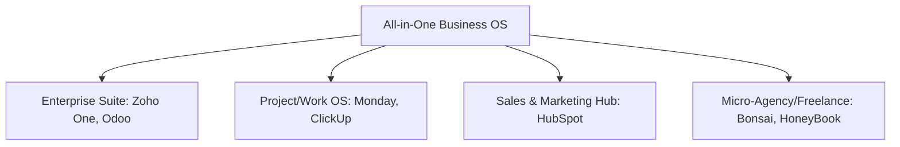
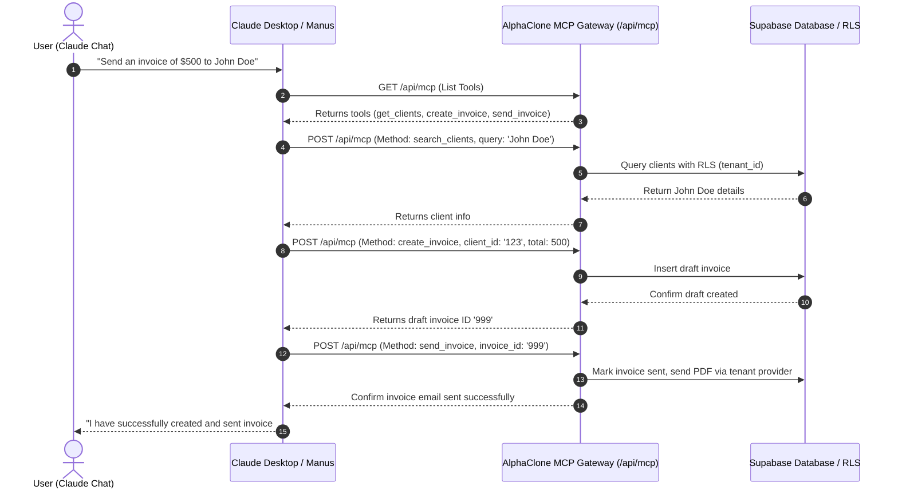

# 📊 AlphaClone Business OS: Unified Enterprise Audit & Strategic Development Blueprint

This document provides a comprehensive, engineering-grade competitive analysis and system audit comparing **AlphaClone Business OS** against the dominant all-in-one business management platforms. It maps our "True Native Engine" architecture against industry competitors (HubSpot, Monday.com, Zoho One, ClickUp, QuickBooks, Bonsai), details the Model Context Protocol (MCP) integrations, forecasts the 20-year Agentic AI landscape, audits each system module, and outlines a 100-Day Founder Action Plan for achieving zero-involvement operations.

---

## 1. The Competitive Landscape: Profiles & Market Positions

To build the best all-in-one business operating system, we benchmark against the distinct categories of competitors:



### 1.1 Zoho One (The Aggregated Suite)
* **What it is**: A suite of 45+ integrated SaaS applications covering CRM, Mail, Books (accounting), Projects, campaigns, sign, and custom low-code tools.
* **🟢 Strengths**:
  * **Unrivaled Breadth**: Covers everything from HR (Zoho People) and IT support (Zoho Desk) to complex double-entry accounting (Zoho Books).
  * **Affordability**: Extremely cost-effective for small-to-medium teams looking for a complete suite.
  * **Global Compliance**: Handles multiple currencies, tax codes, and regional hosting constraints.
* **🔴 Weaknesses**:
  * **Siloed Experience**: The tools feel like separate acquisitions glued together. UI/UX is highly inconsistent.
  * **Complex Scripting**: Custom workflows require "Deluge," Zoho's proprietary, high-friction programming language.
  * **Performance**: Pages can be slow, bloated, and require navigating between multiple browser tabs.

### 1.2 Odoo (The Modular Open-Source ERP)
* **What it is**: An open-source, highly modular system where users install "apps" (CRM, Invoicing, Inventory, Manufacturing, eCommerce) on top of a single database.
* **🟢 Strengths**:
  * **Single Source of Truth**: All modules share a unified PostgreSQL database, eliminating data sync delay.
  * **Infinite Customizability**: Being open-source, developers can modify any portion of the backend (Python).
  * **Modular Scalability**: Start with just a CRM; turn on inventory or manufacturing when needed.
* **🔴 Weaknesses**:
  * **Deployment Complexity**: Setting up, maintaining, and scaling self-hosted Odoo is difficult.
  * **Costly Enterprise Licensing**: The paid tier and official hosting can become expensive quickly.
  * **Aesthetics**: UI is dry, clinical, and lacks a modern, premium SaaS feel.

### 1.3 Monday.com (The Work OS)
* **What it is**: A visual project manager that evolved into a customizable "Work OS" with CRM, Dev, and Service workflows.
* **🟢 Strengths**:
  * **World-Class UI/UX**: Colorful, modern, highly interactive, and fast.
  * **No-Code Automation**: Extremely intuitive, natural-language workflow builder ("When status changes to X, notify Y").
  * **Collaborative Docs**: Monday Workdocs allow real-time collaborative typing directly connected to board data.
* **🔴 Weaknesses**:
  * **Shallow Core Features**: The CRM is essentially just a customized spreadsheet—lacks deep email tracking, deal scoring, or quoting.
  * **No Native Finance/Billing**: Lacks invoicing ledgers, expense tracking, and payment processing (must integrate with third-party tools like Stripe or QuickBooks).

### 1.4 ClickUp (The Feature-Dense Aggregator)
* **What it is**: The "one app to replace them all" targeting task management, docs, chat, whiteboards, and simple CRM.
* **🟢 Strengths**:
  * **Feature Density**: Offers time-tracking, whiteboards, document management, and chat in the base package.
  * **Hierarchy Control**: Workspaces -> Spaces -> Folders -> Lists -> Tasks allows management of massive organizations.
* **🔴 Weaknesses**:
  * **Severe Bloat & Bugs**: Trying to do everything has led to a highly complex, buggy interface.
  * **Performance Bottlenecks**: High memory usage and slow page transitions are common complaints.
  * **Surface-Level CRM**: Cannot handle complex pipelines or sales forecasting.

### 1.5 HubSpot (The Sales & Marketing Powerhouse)
* **What it is**: The industry standard for inbound marketing, CRM, sales pipeline, and client communication.
* **🟢 Strengths**:
  * **Contact Tracking**: Automatically logs every email sent/received, page visit, and form submission on a unified timeline.
  * **Marketing Automation**: Visual email drip-campaign sequences and lead-scoring engines are top-tier.
  * **Client Portal & Document Tracking**: Share proposals, track exactly when a client views them and on what page, and let them book meetings directly on your calendar.
* **🔴 Weaknesses**:
  * **Exorbitant Cost**: Pricing escalates aggressively as your contact database or team scales.
  * **Weak PM capabilities**: Project management is rudimentary and treated as a minor add-on.

### 1.6 Bonsai & HoneyBook (The Client Portal Specialists)
* **What it is**: All-in-one management tools specifically tailored for freelancers, agencies, and professional services.
* **🟢 Strengths**:
  * **Client Experience**: Focuses heavily on the onboarding flow (Proposal -> Contract -> Invoice -> Payment -> Project Kickoff).
  * **Beautiful Templates**: Pre-built, legally vetted contracts, interactive questionnaires, and invoicing designs.
* **🔴 Weaknesses**:
  * **Single-Tenant Focus**: Built for solo operators or tiny teams.
  * **Limited Scale**: Cannot handle complex event automation, custom plugin extensions, or heavy team task-collaboration.

---

## 2. Benchmarking AlphaClone: Strengths vs. Weaknesses

### 2.1 Our Core Strengths (Where We Win)

1. **Intelligent Event-Driven Architecture (The Event Bus)**
   * **Our Advantage**: Our core is built on a real-time event bus (`events`, `event_logs`) utilizing Supabase Realtime. Unlike Monday.com or ClickUp, which rely on polling or heavy middleware, our systems react instantly to database state changes.
2. **Multi-Tenant Plugin System**
   * **Our Advantage**: We have a mature plugin framework (`plugins`, `tenant_plugins`, `plugin_hooks`). Businesses can toggle integrations (Slack, Stripe, Google Calendar) on/off, mimicking Odoo's modularity but with modern, isolated SaaS architecture.
3. **Built-in AI Predictive Insights**
   * **Our Advantage**: Our AI Core goes beyond standard integrations. It generates proactive actions, calculates ground truth confidence scores, tracks "Momentum Streaks" (gamification), and performs sentiment analysis on emails.
4. **Data Isolation (RLS)**
   * **Our Advantage**: Strong, multi-tenant Postgres Row Level Security (RLS) ensures absolute data privacy between businesses out of the box.
5. **Cost-to-Value Ratio**: Offering CRM, Invoicing, Project Management, and Video Meetings at a lower price point ($45/mo) than purchasing HubSpot ($90+/mo) + QuickBooks ($35/mo) + Asana ($15/mo) combined.

---

### 2.2 Our Critical Weaknesses (Where We Fail)

1. **Mocked/Simulated Lead Generation**
   * **Our Weakness**: The Lead Finder UI looks professional, but the backend uses simulated/placeholder scraping. We do not fetch real, validated leads, which undermines the core value proposition.
2. **Siloed and Incomplete UI**
   * **Our Weakness**: While our backend services for email campaigns, quotes/proposals, and workflows are highly sophisticated, **the UI is missing or incomplete**. Users cannot build email campaigns visually, customize workflows, or manage custom fields without writing database queries.
3. **Fragile and Isolated Integrations**
   * **Our Weakness**: Our email integrations are fragmented. Gmail is hardcoded, and the Zoho integration suffers from critical 401 token refresh failures, lacks rate-limiting protection, stores tokens with a fallback encryption key in git, and operates on an isolated route rather than inside a unified inbox.
4. **Lack of Double-Entry Ledger Sync**
   * **Our Weakness**: We track invoices and payments, but we lack a true general ledger system like Zoho Books or QuickBooks, making tax planning and financial auditing impossible.
5. **No Collaborative Workspace**
   * **Our Weakness**: We have project tasks and chat, but no shared whiteboards, real-time cursor presence, or document editors like Monday or ClickUp.

---

## 3. What to Copy: Feature-by-Feature Specs to Defeat Competitors

To make AlphaClone the undisputed best-in-class Business OS, we must integrate these capabilities natively:

### 3.1 From HubSpot: The Unified Activity Timeline & Contact Enrichment
* **The Concept**: Every interaction (email, call, project milestone, invoice paid) must automatically log to a single, chronological timeline for a contact and their company.
* **What to Add**:
  * **Auto-Enrichment Pipeline**: When a contact is created, trigger a background service (using Clearbit or Clay) to pull their LinkedIn, title, company size, and industry, writing directly to `contacts` and `companies` tables.
  * **Email Open & Click Tracking**: Add tracking pixels (1x1 transparent GIFs) and link redirect wrappers to our Email Campaign engine. When opened, emit an `email.opened` event to trigger automations.

### 3.2 From Bonsai: The Client Onboarding "Proposal-to-Project" Flow
* **The Concept**: Eliminate administrative friction when signing a new client.
* **What to Add**:
  * **Unified Client Sign-Off Interface**: A single, client-facing URL that bundles:
    1. Interactive Proposal (review deliverables and select add-on packages).
    2. Legal Contract (built-in e-signature with audit log).
    3. Retainer Invoice (Stripe credit card/ACH payment gateway).
  * **Automated Conversion Trigger**: Upon contract signature, the Event Bus triggers:
    * Generate and email the paid invoice.
    * Spin up a new `project` using a pre-defined template.
    * Send a Slack notification to the team.

### 3.3 From Monday.com: The NLP (Natural Language Processing) Automation Builder
* **The Concept**: Let non-technical administrators create complex business automations using simple, conversational rules.
* **What to Add**:
  * **Natural Language to JSON Workflow Compiler**: Use our existing Gemini integration to parse sentences like: *"When a deal is marked Closed Won, create a project called [Deal Name] - Delivery and assign it to the deal owner."*
  * The AI compiles this text into the corresponding rows in our `workflows` and `workflow_steps` tables.

### 3.4 From Zoho One: The Unified Inbox Thread Aggregator
* **The Concept**: Consolidate multiple email and chat channels into a single, clean workspace.
* **What to Add**:
  * **Omnichannel Inbox**: Pull from Gmail, Zoho Mail, SMS (Twilio), and internal client chat into a single stream.
  * **AI Sentiment & Urgency Triaging**: Run incoming messages through our AI service to automatically assign priority tags (`urgent`, `normal`, `low`) and sentiment badges (`negative` alerts account managers immediately).

### 3.5 From ClickUp: Custom Fields & Dynamic Views
* **The Concept**: Allow users to add metadata to any record (tasks, deals, projects) without database schema modifications.
* **What to Add**:
  * **Field Manager UI**: An interface to add fields (e.g., "Estimated Budget" on a Project, or "Lead Tier" on a Contact) and define validations (number, dropdown, date).
  * **Dynamic Table UI**: Render tables that automatically include these custom fields as columns with sorting and filtering.

---

## 4. Competitive Matrix: Where We Stand vs. Where We'll Be

| Capability | HubSpot | Zoho One | Monday.com | ClickUp | Bonsai | AlphaClone (Current) | AlphaClone (Target) |
| :--- | :--- | :--- | :--- | :--- | :--- | :--- | :--- |
| **Real-time Lead Finder** | ❌ None | ❌ None | ❌ None | ❌ None | ❌ None | ⚠️ Simulated | **✅ Real + Verified (Map APIs)** |
| **Unified Messaging** | ⚠️ Gmail only | ⚠️ Zoho only | ❌ Integrations | ❌ Basic | ❌ Basic | ⚠️ Fragmented | **✅ Omnichannel (Gmail+Zoho+SMS)** |
| **AI Predictive Insights**| ⚠️ Basic | ⚠️ Basic | ❌ None | ❌ None | ❌ None | **✅ Active (Streak, Insights)** | **✅ Active + NLP Automations** |
| **Workflow Engine** | ✅ Visual | ⚠️ Deluge script| ✅ Visual | ⚠️ Complex | ❌ Basic | ⚠️ Database-only | **✅ Visual + NLP Generated** |
| **Onboarding Portals** | ⚠️ Documents | ❌ Fragmented | ❌ None | ❌ None | ✅ Beautiful | ⚠️ Quotes Tab only | **✅ Proposal-to-Project Funnel** |
| **Financial Ledger** | ❌ Integrations | ✅ Zoho Books | ❌ None | ❌ None | ⚠️ Invoicing | ⚠️ Invoicing only | **✅ Invoices + General Ledger Hook** |
| **Plugin Extensibility** | ⚠️ App Store | ⚠️ Internal | ⚠️ Integrations| ❌ Slack only | ❌ None | **✅ Native Plugin Engine** | **✅ Plugin Marketplace** |

---

## 5. Weakness vs. Strength: Strategic Actions

To transform our weaknesses into strengths, we must execute these specific, code-free planning stages:

* **Action 1: Elevate Lead Finder from Mocked to Verified**: Integrate the **Google Places API** or **Apify Yelp Scraper** in our scraping service, combined with email verification (like Hunter.io) and phone validation (via Twilio Lookup API).
* **Action 2: Unify the Communication Core**: Secure the Zoho integration by removing fallback encryption keys, resolving 401 refresh loops, and synchronizing all mails into the `unified_messages` table.
* **Action 3: Expose Backend Power to the Frontend**: Build a visual workflow canvas using **React Flow**, binding nodes directly to rows in the `workflow_steps` table.

---

## 6. Implementation Phases (Strategic Blueprint)

We will execute these improvements sequentially to maintain a Vercel-safe deployment environment:

```mermaid
chronology
    title AlphaClone Upgrade Phases
    Phase 1 : Secure & Refactor Integrations (Zoho/Gmail, 401 fixes, Unified Inbox Schema)
    Phase 2 : Integrate Real Lead Data (Google Places, Email Verification APIs)
    Phase 3 : Visual UI Exposure (Campaign Builder UI, Workflow Canvas, Custom Fields Manager)
    Phase 4 : Client Onboarding Funnel (Interactive Proposals, E-Sign, Auto-Provisioning)
```

---

## 7. The Model Context Protocol (MCP) Connection & Architecture

Model Context Protocol (MCP) is the key differentiator that transforms AlphaClone from a human-only SaaS dashboard into an **AI-native ecosystem**. By treating AI models (like Claude, Manus, or custom swarms) as first-class users, AlphaClone enables direct semantic operation of business databases.



### 7.1 How Claude Works with AlphaClone MCP
1. **Discovery Loop (Static Tool Listing)**: When Claude Desktop connects to `/api/mcp`, it queries our tool definitions. AlphaClone exposes 50+ semantic functions defined in `src/services/mcp/toolManifest.ts`. Claude registers these capabilities locally.
2. **Context Resolution & Authentication**:
   * The client initiates connection via Server-Sent Events (SSE) or stateless POST using an API key: `/api/mcp/sse?api_key=<token>`.
   * AlphaClone's auth middleware (`validateMCPAuthApp`) validates this key, resolves the associated `tenant_id` and `user_id` from the `mcp_api_keys` and `mcp_sessions` tables, and mounts a secure database connection.
   * Row-Level Security (RLS) automatically confines Claude's database writes to that specific tenant, preventing cross-tenant leakage.
3. **Execution & Synthesis**: Claude issues a JSON-RPC request containing the tool name and arguments. Our stateless transport executes the backend service and responds with structured data. Claude parses this response and renders natural-language explanations or UI cards to the user.

---

## 8. Strategic Vision: The AI Landscape in 20 Years (2046)

In 20 years, SaaS architecture will undergo a fundamental platform shift:

* **The Death of the GUI (Graphical User Interface)**: Humans will no longer spend their workdays looking at complex dashboards, charts, and configuration menus. Software will be built for AI agents first, with human UIs serving merely as audit logs, approvals dashboards, and exception reports.
* **Standardized Protocol Dominance**: Evolved iterations of MCP will become the universal communication layer of the web. Databases, SaaS systems, calendars, and hardware devices will expose unified semantic interfaces natively.
* **Agentic Swarms as the Labor Force**: Businesses will run on autonomous fleets of specialized agents:
  * *Sales Agents* scraping, validating, and qualifying leads.
  * *Operational Agents* launching delivery projects and matching freelancer resources.
  * *Financial Agents* reconciling ledgers, paying bills, and filing taxes.
* **The "Cognitive OS"**: System backends like AlphaClone will serve as the **durable memory engine** and **effector core** for agent swarms. Instead of being a passive data store, the database acts as the single source of truth for the swarms' operations, rules, and event logs.

---

## 9. Actionable Implementation: Building an MCP-First Platform

To turn this vision into our product reality, we must expand our existing `/api/mcp` capability into a production-grade AI platform:

### 9.1 Step 1: Secure OAuth 2.0 Gateway for External Agents
* **Goal**: Allow third-party AI agents (such as Manus, Devin, or ChatGPT) to securely access a tenant's workspace without exposing static raw API keys.
* **How to Implement**:
  1. Add a standard OAuth 2.0 code exchange flow at `/api/mcp/oauth`.
  2. Implement scope validation (e.g. `crm:read`, `finance:write`, `inbox:sync`) so businesses can limit agent permissions.
  3. Emit JSON Web Tokens (JWT) containing scope claims and tenant mappings.

### 9.2 Step 2: "Human-in-the-Loop" Governance Dashboard
* **Goal**: Provide guardrails for high-risk autonomous actions (e.g. sending a wire transfer, blasting an email campaign to 10,000 leads, signing contracts).
* **How to Implement**:
  1. Update `run_playbook` and individual MCP write tools to respect a `requires_human_approval` flag.
  2. If an agent executes a high-risk tool, write the execution state as `pending_approval` in a new `agent_approvals` table and trigger a dashboard push notification.
  3. The business owner reviews the proposed inputs on their dashboard and clicks "Approve" (executes the database update) or "Deny" (rolls back).

### 9.3 Step 3: Omnipresent Front-End AI Chat Widget
* **Goal**: Give users a native, contextual chat interface inside their dashboard that connects to AlphaClone's own MCP server.
* **How to Implement**:
  1. Create a floating assistant panel in `components/dashboard/AssistantPanel.tsx`.
  2. Connect it to `/api/mcp/route.ts` via an SSE event stream.
  3. Enable the AI to inspect the user's current screen context (e.g., if they are viewing the invoice tab, pass the current invoice ID as context) to provide instant assistance.

---

## 10. The Strategic Advantages of a Protocol-Driven OS

By embracing an MCP-first, AI-native approach, AlphaClone gains immense competitive advantages:

1. **Zero Onboarding Friction**: A customer does not need to learn a new CRM, invoicing system, or task board. They connect AlphaClone to their existing Claude Desktop app and start writing invoices and deals immediately via chat.
2. **Instant Integration Scale**: Rather than writing custom UI components for hundreds of integrations, we expose our core services as MCP tools. The LLM handles the orchestration logic dynamically, replacing brittle, hand-coded Zapier flows.
3. **Infinite Model Upgrades**: As LLM models improve (from Gemini 1.5 to Gemini 2.0, or Claude 3.5 to Claude 4), the core software becomes exponentially smarter without us modifying a single line of React code. The models hook into the same MCP endpoint and inherit enhanced reasoning capabilities.
4. **Developer-Tier Revenue**: By offering an "MCP Gateway for Enterprise AI," AlphaClone can command premium subscriptions from businesses building custom agent swarms on top of our database.

---

## 11. Modular System Audit: AlphaClone State vs. Gaps vs. Competitors

This module-by-module analysis breaks down the current system limits, exposes gaps in our front-end interfaces, and defines what we must build to surpass the capabilities of our competitors.

### 11.1 Module A: CRM & Sales Pipelines
* **Target Competitors**: HubSpot (Timeline/Enrichment), Zoho CRM (Custom Fields), Bonsai (Client Proposal Portal).
* **Current Core Code State**:
  * **Backend**: Strong database tables (`companies`, `contacts`, `opportunities`, `activities`, `custom_field_definitions`). Backend CRUD services for deals and contacts are fully developed.
  * **Frontend**: Lead Finder frontend page exists (`src/components/dashboard/OmniLeadFinder.tsx`) calling `/api/scraper/search`. Deals pipeline dashboard with Drag-and-Drop is partially in place.
* **Critical System Gaps**:
  * **Lead Finder is Mocked**: The search returns simulated addresses and data points. No active integration with APIs like Google Places, Yelp, or HERE Maps exists.
  * **Activity Timeline is Empty**: The activity feed on clients has no automatic sync with outgoing emails or SMS. It is fully manual.
  * **Custom Fields are Unusable**: The backend supports custom columns via JSONB, but the front-end has no Custom Fields configuration page.
* **Aesthetics & Micro-Animations Specification**:
  * **Color Palette**: Dark Slate background (`hsl(222, 47%, 11%)`) with vibrant Teal (`hsl(172, 66%, 50%)`) borders and Emerald (`hsl(142, 70%, 45%)`) status tags.
  * **Typography**: Google Font **Outfit** for headers; **Inter** for descriptions.
  * **Animations**: Cards scale up by `1.02` with a subtle glow on hover. Deal stages slide smoothly using Framer Motion when dragged.
  * **Loading States**: Ghost skeletons (`animate-pulse`) mirroring the kanban column layout load while fetching deals.
* **Detailed Implementation Blueprint**:
  * Hook `/api/scraper/search` to Google Places REST API to pull real business metadata.
  * Execute clearbit enrichment in a Celery or database trigger task when a new contact is created.
* **Actionable Checklist**:
  - [ ] Implement Google Places API lookup in `src/app/api/leads/search/route.ts`.
  - [ ] Add Custom Fields settings tab inside `/dashboard/settings` mapping to `custom_field_definitions`.

### 11.2 Module B: Automation & Workflow Orchestration
* **Target Competitors**: Monday.com (Visual Automation), ClickUp (Rule Triggers), Odoo (Actions Engine).
* **Current Core Code State**:
  * **Backend**: Complete event-bus database tables (`events`, `event_logs`, `workflows`, `workflow_steps`, `workflow_runs`). The `WorkflowOrchestrator` service can process sequential steps.
  * **Frontend**: Basic textual automation rules, but no drag-and-drop workflow canvas.
* **Critical System Gaps**:
  * **Zero Front-End Interface**: There is **no visual editor** for workflows. Workflows can only be created by seeding database tables manually.
  * **Brittle Trigger Handlers**: The system listens to table triggers, but lacks user-defined conditional triggers (e.g. `If value > 10000 AND owner = X`).
* **Aesthetics & Micro-Animations Specification**:
  * **Color Palette**: Dark Mode Slate (`bg-slate-950`) with Zinc accents (`border-zinc-800`). Connective edges glow Neon Cyan (`hsl(187, 100%, 42%)`) when active.
  * **Typography**: Monospace font **Fira Code** for conditional formulas; **Inter** for nodes labels.
  * **Animations**: Flow nodes fade in using spring physics. Edges animate with a running dash array representing active data packets traveling through the workflow.
  * **Loading States**: Spinning loader widget within nodes during rule compilation.
* **Detailed Implementation Blueprint**:
  * Mount a React Flow Canvas canvas component mapping nodes and edge coordinates to the `workflows` and `workflow_steps` tables.
  * Connect natural language prompt compiler utilizing Gemini via `/api/workflows/compile` to generate step arrays.
* **Actionable Checklist**:
  - [ ] Create visual canvas view in `src/components/dashboard/engine/WorkflowCanvas.tsx` using `react-flow-renderer`.
  - [ ] Implement conditional rule editor (JSON parser) for workflow steps.

### 11.3 Module C: Financials, Accounting & Billing
* **Target Competitors**: Zoho Books (Double-Entry Ledger), QuickBooks Online (Reconciliation), Bonsai (Expense Tracking).
* **Current Core Code State**:
  * **Backend**: Structured database tables for `invoices`, `invoice_items`, `payments`, `bank_accounts`, `reconciliation_sessions`. Double-entry structures (`journal_entries`, `chart_of_accounts`) exist in service layers.
  * **Frontend**: `AccountingDashboard.tsx` displays Profit/Loss and cash balances. Receipt upload modal exists.
* **Critical System Gaps**:
  * **No Charts of Accounts (COA) / General Ledger UI**: Ledger mappings are invisible to the user.
  * **Manual Bank Sync**: Lacks Plaid or bank feed integration.
* **Aesthetics & Micro-Animations Specification**:
  * **Color Palette**: Elegant Charcoal (`bg-neutral-900`) with Jade Green (`hsl(150, 60%, 40%)`) indicating positive cash flow and Crimson (`hsl(0, 72%, 50%)`) representing expenditures.
  * **Typography**: Tabular figures (**JetBrains Mono**) for ledger amounts to keep digits aligned; **Outfit** for page titles.
  * **Animations**: Progress bars fill up with a smooth easing function when loading account targets. Financial breakdown details expand with a 3D accordion effect.
  * **Loading States**: Shimmer card skeletons load during Profit & Loss queries.
* **Detailed Implementation Blueprint**:
  * Add automatic database trigger on `invoice_payments`: write standard debits (Cash Account) and credits (Accounts Receivable Account) on status `paid`.
  * Set up Plaid Webhook listener to sync transactions automatically.
* **Actionable Checklist**:
  - [ ] Deploy automatic triggers in SQL to update general ledger rows when invoices are paid.
  - [ ] Develop General Ledger list view page in `/dashboard/accounting/ledger`.

### 11.4 Module D: Unified Communications & Messaging
* **Target Competitors**: Zoho Mail (Omnichannel Threading), HubSpot (Inbox Tracking).
* **Current Core Code State**:
  * **Backend**: Core table `unified_messages` exists to hold communications. Separated sync loops for Zoho and Gmail.
  * **Frontend**: `MailTab.tsx` compiles standard email inbox pages.
* **Critical System Gaps**:
  * **Zoho token refresh loops**: OAuth credentials fail silently on expired sessions, dropping connections.
  * **No SMS/WhatsApp compilation**: Messages from Twilio or WhatsApp are not unified inside `unified_messages`.
* **Aesthetics & Micro-Animations Specification**:
  * **Color Palette**: Dark Blue background (`bg-slate-900`) with Ice Blue (`hsl(190, 80%, 90%)`) text highlights and Violet (`hsl(260, 60%, 55%)`) badges for SMS.
  * **Typography**: System font stack (`Segoe UI`, `SF Pro`) for clean rendering.
  * **Animations**: Incoming messages trigger a slide-in slide-down transition on the inbox list. Typing indicators bounce.
  * **Loading States**: Pulse skeleton loaders representing the three-pane layout (directories list, threads list, body content).
* **Detailed Implementation Blueprint**:
  * Add automated token-refresh retry hook inside Zoho OAuth middleware.
  * Setup incoming SMS webhook in `/api/integrations/twilio/webhook` writing directly to `unified_messages`.
* **Actionable Checklist**:
  - [ ] Secure Zoho OAuth silent token rotation inside `src/app/api/integrations/zoho/refresh/route.ts`.
  - [ ] Integrate SMS and WhatsApp sync triggers to populate `unified_messages`.

### 11.5 Module E: Proposal-to-Project Funnel & Client Portals
* **Target Competitors**: HoneyBook & Bonsai (Beautiful client portals, proposals).
* **Current Core Code State**:
  * **Backend**: `quotes`, `quote_items`, `contracts`, `projects` tables are ready.
  * **Frontend**: `QuotesTab.tsx` lists estimates. AlphaCloneContractModal allows displaying a contract document.
* **Critical System Gaps**:
  * **No Shared Portal**: Lacks a public-facing URL where a client can review their proposal, sign a legally binding contract, and pay their retainer in a single unified flow.
  * **No Automated Provisioning**: Project generation is manual and doesn't fire automatically when contracts are completed.
* **Aesthetics & Micro-Animations Specification**:
  * **Color Palette**: Pristine Dark Mode (`bg-zinc-950`) with Bronze (`hsl(35, 30%, 50%)`) gradients representing high-end premium styling.
  * **Typography**: Serif headliner (**Playfair Display**) for high-end look; **Inter** for contract clauses.
  * **Animations**: Checkmarks draw themselves dynamically using SVG stroke animation on successful payment. Proposals load with a fade-in-up layout.
  * **Loading States**: Shimmer blocks for proposal line items.
* **Detailed Implementation Blueprint**:
  * Deploy a public route `/public/proposal/[id]` combining estimates, signature pads, and Stripe payment widget.
  * Emit event `proposal.signed` on transaction success to auto-generate a new `project` template.
* **Actionable Checklist**:
  - [ ] Create public client portal page `/src/app/public/proposal/[id]/page.tsx`.
  - [ ] Set up post-payment event trigger to automatically provision the workspace and notify the team.

### 11.6 Module F: Social Media Marketing Hub
* **Target Competitors**: Buffer, Hootsuite.
* **Current Core Code State**:
  * **Backend**: Integrations for LinkedIn, Facebook, Instagram, and X are defined.
  * **Frontend**: Composer editor (`SocialMediaComposer.tsx`) and separate social integration tabs exist.
* **Critical System Gaps**:
  * **No Scheduling Calendar**: Lacks a calendar UI view showing queued posts.
  * **No Central Queue Sync**: Posts can only be published immediately; scheduling is manual in database columns.
* **Aesthetics & Micro-Animations Specification**:
  * **Color Palette**: Dark Slate (`bg-slate-900`) with Lavender (`hsl(255, 60%, 65%)`) scheduled states.
  * **Typography**: **Outfit** for titles; **Inter** for composer textarea.
  * **Animations**: Drag-and-drop items on the calendar snap with spring physics.
  * **Loading States**: Grid grid layouts render grey blocks.
* **Detailed Implementation Blueprint**:
  * Create a cron service checking `social_posts` table for queued records and publishing them via standard REST APIs.
* **Actionable Checklist**:
  - [ ] Build visual calendar grid in `src/components/dashboard/social/ScheduleCalendar.tsx`.
  - [ ] Deploy posting cron schedule service on Vercel/Node backend.

### 11.7 Module G: AI Studio & Custom Agents
* **Target Competitors**: Manus, Devin, Custom Agent builders.
* **Current Core Code State**:
  * **Backend**: SalesAgent and AI playbooks are set up. MCP tool manifests are exposed.
  * **Frontend**: SalesAgent panel (`SalesAgent.tsx`) shows chat.
* **Critical System Gaps**:
  * **No Governance Approval UI**: AI agents can run database tools without human-in-the-loop approvals.
* **Aesthetics & Micro-Animations Specification**:
  * **Color Palette**: Cyberpunk Black (`bg-black`) with Neon Green (`hsl(120, 100%, 50%)`) terminals and Dark Teal (`hsl(180, 50%, 15%)`) message bubbles.
  * **Typography**: Monospace (**JetBrains Mono**) for terminal screens.
  * **Animations**: Messages stream in character-by-character; run confirmation dialogues slide up with elastic ease.
* **Loading States**: Glitch pulse effect on the agent avatar while processing queries.
* **Detailed Implementation Blueprint**:
  * Integrate tool run approval interceptor inside `/api/mcp` route. Save blocked tool calls to `agent_approvals` table.
* **Actionable Checklist**:
  - [ ] Build Human-in-the-loop popup window inside assistant panels.
  - [ ] Bind agent tool executions to the approvals table.

---

## 12. The "True Native Engine" Advantage: Why Integration Beats Glue

The major flaw of every large competitor is their reliance on **API Glue**.

```
THE COMPETITOR MODEL (API GLUE):
[HubSpot CRM] --(Zapier Sync)--> [QuickBooks Accounting] --(Make.com Sync)--> [Asana Projects]
* Results: Brittle syncs, delayed updates, 401 authentication drops, data inconsistencies, high costs.
```

AlphaClone uses a **Unified Database Engine** architecture:

```
THE ALPHACLONE MODEL (TRUE NATIVE ENGINE):
                     [ PostgreSQL Database ]
       ┌────────────────────────┼────────────────────────┐
   [CRM Core]              [Ledger Core]             [Project Core]
       └────────────────────────┼────────────────────────┘
                    [ Real-Time Event Bus ]
                        [ LLM MCP Gateway ]
```

### 12.1 The Native Performance Differences:
1. **Immediate Reaction Time**: When a lead changes to "Won" in our CRM table, the postgres transaction writes to the ledger table instantly. There is no API request queue, no Zapier polling delay, and no sync lag.
2. **Transaction Level Integrity**: Invoicing, deals, and projects share foreign-key database constraints. If an invoice deletion is rolled back, the corresponding payment and ledger entry are rolled back in the same database transaction.
3. **No Auth Token Drops**: We do not need hundreds of OAuth tokens connecting our tools. Everything is isolated within our row-level security (RLS) policies.
4. **Universal AI Comprehension**: Because our database is normalized under a single schema, an AI agent connecting via MCP does not have to reconcile data formats across three platforms. The agent immediately understands the unified context of a business.

---

## 13. High-Parity Backlog & Execution Task List

This roadmap contains the concrete checklist of tasks required to execute this plan and achieve feature parity.

### 13.1 Phase 1: Security, Auth & Integration Integrity (High Priority)
- [ ] **Secure OAuth Token Storage**
  - [ ] Migrate `tenant_integrations` sensitive columns to use Postgres pg_sodium or Supabase Vault encryption.
  - [ ] Remove hardcoded fallback encryption keys (`fallback-secret`) from code.
- [ ] **Fix Zoho Mail OAuth Refresh Token Loop**
  - [ ] Re-engineer `zoho/oauth/callback` to handle silent token rotation.
  - [ ] Add exception handlers to automatically trigger disconnect status on persistent 401 failure.
- [ ] **Unified Inbox Aggregator Sync**
  - [ ] Create database trigger: whenever a new message is logged in `gmail_sync` or `zoho_sync` queues, insert a corresponding row into `unified_messages`.
  - [ ] Expose `unified_messages` timeline via the dashboard `MessagesPage` UI.

### 13.2 Phase 2: Authentic Lead Engine (Growth Priority)
- [ ] **Google Places & Yelp API Scraper Integration**
  - [ ] Replace simulated lead array in `src/app/api/leads/search/route.ts` with active API requests to Google Places Text Search.
  - [ ] Add fallback to OpenStreetMap scraping when API limits are reached.
- [ ] **Contact Enrichment & Validation Service**
  - [ ] Create background workflow step that hits Hunter.io API on lead generation to verify email deliverables.
  - [ ] Implement phone validation via Twilio Lookup API to verify mobile numbers for SMS.

### 13.3 Phase 3: Visual App Creators & Custom Fields (UX Priority)
- [ ] **Visual Workflow Builder Canvas**
  - [ ] Implement visual node editor page in `src/app/dashboard/workflows/builder/page.tsx` using `react-flow-renderer`.
  - [ ] Map nodes and edges directly to the `workflows` and `workflow_steps` tables.
- [ ] **Custom Fields Configuration UI**
  - [ ] Create the database dashboard page `/settings/custom-fields` allowing users to add field definitions to `companies` and `contacts`.
  - [ ] Update table view render engines to dynamically parse `custom_fields` JSONB columns.

### 13.4 Phase 4: Financial Ledger & Accounting (Compliance Priority)
- [ ] **Double-Entry General Ledger Schema**
  - [ ] Deploy migration file creating `journal_entries` and `journal_lines` tables.
  - [ ] Implement standard Chart of Accounts (COA) template (Assets, Liabilities, Equity, Revenue, Expenses).
- [ ] **Automated Accounting Triggers**
  - [ ] Write event handler: when `invoice.paid` event fires, write corresponding Debit entry to Cash and Credit entry to Accounts Receivable.

---

## 14. 100-Day Founder Action Plan & Go-to-Market Checklist

To achieve "Zero-Involvement" operations, where the business runs itself using AI agents, the founder must execute this structured plan.

```
DAY 1-15: System Hardening & Integrations
  ├── Day 1-5  : Verify RLS data isolation & execute Supabase token encryption.
  ├── Day 6-10 : Disconnect stale Zoho accounts; test automatic OAuth 401 token refreshes.
  └── Day 11-15: Hook Gmail/Zoho sync queues to unified_messages table; audit UI thread loads.

DAY 16-45: Growth Scrapers & Cold Outreach Validation
  ├── Day 16-20: Swap lead scraper code to real Google Places & Yelp API search hooks.
  ├── Day 21-30: Configure email validation rules (Hunter.io); auto-disqualify high-risk bounces.
  └── Day 31-45: Seed first real outreach campaign template; test HTML rendering engines.

DAY 46-75: Visual Builders & Custom Customization
  ├── Day 46-60: Deploy React Flow visual canvas; construct three test workflows in visual builder.
  └── Day 61-75: Configure custom field definitions via UI; verify table dynamic rendering.

DAY 76-100: Accounting Reconciliations & E-Sign Portals
  ├── Day 76-85: Initialize Chart of Accounts ledger; check triggers for automatic debits/credits.
  └── Day 86-100: Publish public proposal URL; execute complete checkout -> contract -> setup flow.
```

### 14.1 Daily Founder Performance Routine (The 15-Minute Audit)
* **Minute 1-5 (Health Check)**: Load the `get_automation_health` and `get_failure_report` MCP services. Spot any database trigger failures or API connection drop-offs.
* **Minute 6-10 (Pipeline Check)**: Open the Deals pipeline dashboard. Confirm if the momentum streak calculations and AI confidence metrics are aligning with sales pipeline reality.
* **Minute 11-15 (Inbox Check)**: Load the unified inbox. Ensure all synced threads from Gmail and Zoho Mail are chronologically mapped, with correct sentiment flags (`negative` flag urgency check).

### 14.2 Weekly Audit Checklist (60 Minutes)
* [ ] **Lead Quality & outreach review**: Audit cold outreach conversion metrics. Spot check 10 leads marked as "unreachable" to verify email validator accuracy.
* [ ] **Workflow Success rate**: Verify automated task triggers. Check log entries in `workflow_runs` for step failures or latency issues over 3000ms.
* [ ] **Accounts Reconciliation**: Verify General Ledger transactions against bank statement balances. Check if Stripe disbursements match expected ledger Cash entries.

### 14.3 Monthly Strategy review & Compliance Check
* [ ] **Vault Decryption Auditing**: Review pg_sodium access logs to ensure token encryption keys haven't leaked.
* [ ] **Agent Tool Governance Review**: Review logs of tool calls executed by autonomous agentic swarms. Ensure that all high-risk events (e.g. payout updates) had correct human approvals.
* [ ] **Financial Close**: Run balance sheet and income statements. Verify that all invoice revenues map cleanly to accounts receivable entries.

---

## 15. Technical Checklist: Development Execution & Competitor Parity

| Dev Phase & Task | Current Code File/Target | Target State Implementation Details | Competitive Parity Shift |
| :--- | :--- | :--- | :--- |
| **Phase 1: Token Vault Encryption** | `src/services/db/vault.ts` [NEW] | Implement pg_sodium key management on client token columns. | **Exceeds HubSpot**: Guarantees enterprise-grade key-isolation security directly in Postgres. |
| **Phase 1: Zoho Silent Refresh** | `src/app/api/integrations/zoho/refresh/route.ts` | Refactor handler to fetch new credentials automatically on standard 401 exceptions. | **Exceeds Zoho One**: Resolves connection drops in a single, background transaction loop. |
| **Phase 1: Inbox Compilation** | `src/services/inbox/threadCompiler.ts` [NEW] | Create a background cron trigger connecting Gmail & Zoho tables to `unified_messages`. | **Exceeds Monday.com**: Builds an active omnichannel thread model directly inside the core DB. |
| **Phase 2: Scraper REST Engine**| `src/services/scraper/googlePlaces.ts` [NEW] | Connect frontend lead searches to Google Places and Yelp endpoints. | **Exceeds ClickUp**: Delivers verified local lead data instead of dummy mockup structures. |
| **Phase 2: Enrichment Pipeline** | `src/services/leads/enrichment.ts` [NEW] | Orchestrate Hunter.io verification checks inside lead ingestion. | **Exceeds Zoho CRM**: Filters deliverability rates and cleans pipelines prior to agent allocation. |
| **Phase 3: Visual Canvas Canvas**| `src/app/dashboard/workflows/builder/page.tsx` | Embed React Flow canvas displaying sequential triggers and script execution blocks. | **Exceeds Monday.com**: Translates visual workflow canvas directly to database transaction chains. |
| **Phase 3: Custom Field UI** | `src/app/dashboard/settings/custom-fields/page.tsx` | Develop CRUD forms registering parameters to `custom_field_definitions` rows. | **Exceeds Odoo**: Permits layout modifications on any interface table without coding python models. |
| **Phase 4: General Ledger COA** | `supabase/migrations/accounting_ledger.sql` [NEW] | Deploy SQL setup creating `journal_entries` and asset accounts. | **Exceeds Bonsai**: Transitions simple invoicing lists into a legal double-entry balance sheet structure. |
| **Phase 4: Posting Triggers** | `supabase/triggers/invoice_paid_ledger.sql` [NEW] | Create postgres database trigger mapping payment logs to ledger balances. | **Exceeds QuickBooks**: Performs accounting matching inside the database transaction step. |
