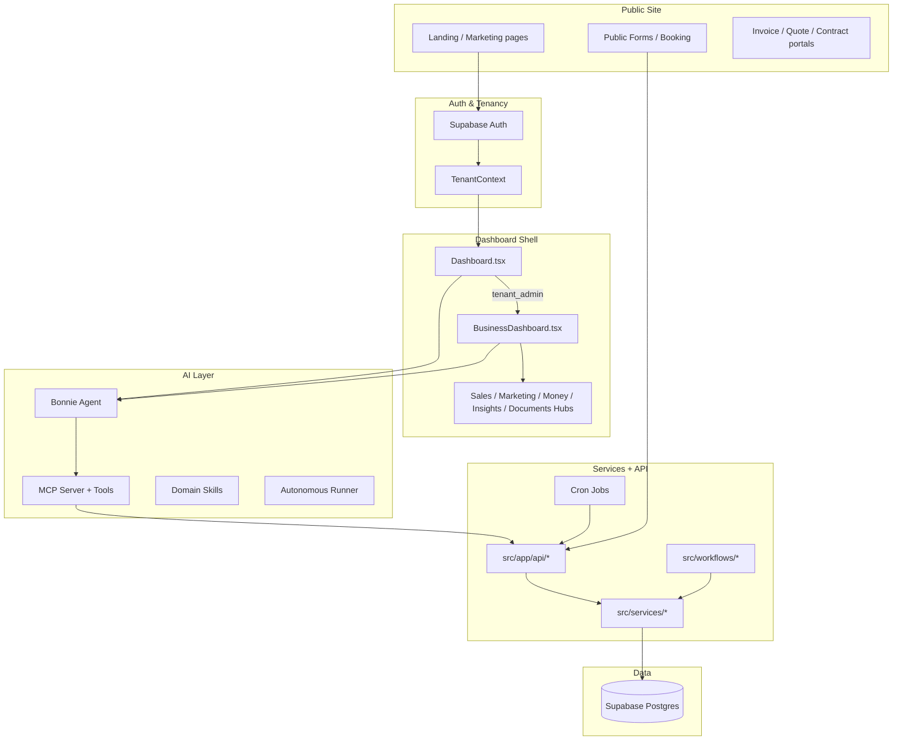
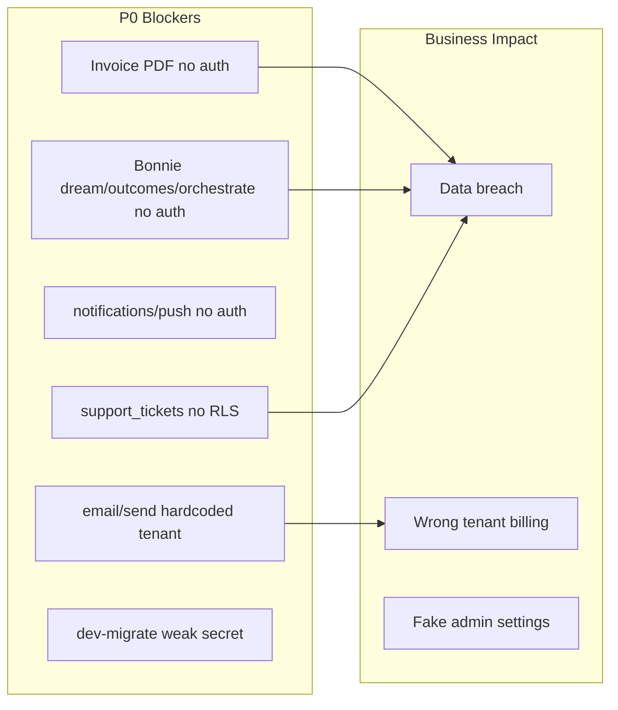

# AlphaClone Platform A–Z Audit

**Audit date:** June 25, 2026  
**Scope:** Full platform — public site, tenant dashboard, admin, API layer, data layer, integrations, Bonnie AI, MCP, crons  
**Method:** Code review of ~315 API routes, 262 dashboard components, 186 Supabase migrations, existing audit docs, and cross-agent analysis  
**Overall grade: C+** — Impressive breadth and a genuinely strong AI/MCP backbone, but production trust is undermined by security holes, hardcoded tenant paths, fake admin persistence, and marketing that still oversells unproven outcomes.

---

## Executive verdict (brutal)

AlphaClone is **not a demo** — it is a real, sprawling multi-tenant Business OS with CRM, marketing, accounting, tickets, video, 24 cron jobs, and a mature Bonnie + MCP agent stack. That breadth is rare and valuable.

But **breadth ≠ readiness**. The platform has three fatal honesty problems:

1. **Security theater** — Several routes expose tenant data, PDFs, and push notifications without auth. Bonnie admin routes accept `tenant_id` from the body with admin DB access.
2. **Hardcoded platform tenant** — `src/app/api/email/send/route.ts` routes all email through one tenant UUID and one Zoho account. This is not a bug; it is architectural malpractice in a multi-tenant product.
3. **UI that lies** — Global Settings saves with a toast but persists nothing. Marketplace shows "Connect" then toasts "Coming soon." Period close runs on `localStorage`. Gamification is static demo data presented as a nav item.

**If you shipped this to enterprise buyers today**, they would love the demo, then discover the invoice PDF UUID leak, the fake admin settings, and the dual ticket tables — and churn.

---

## Scorecard at a glance

| Grade          | Count | Letters                                                        |
| -------------- | ----: | -------------------------------------------------------------- |
| **PASS**       |     8 | B, K, L, V, W (partial), D (partial), E (partial), I (partial) |
| **INCOMPLETE** |    14 | C, F, G, H, J, M, N, O, P, Q, R, T, U, X                       |
| **FAIL**       |     4 | A, S, Y, Z                                                     |

---

## Architecture overview



---

## A–Z findings (every letter)

### A — Authentication & Access Control — **FAIL**

|             |                                                                                                                                                                                                                                                                                                                                                                                                                                                       |
| ----------- | ----------------------------------------------------------------------------------------------------------------------------------------------------------------------------------------------------------------------------------------------------------------------------------------------------------------------------------------------------------------------------------------------------------------------------------------------------- |
| **Passes**  | OAuth flows for Google, Microsoft, LinkedIn, Zoho, Facebook, Instagram, X exist and generally check session before redirect (`src/app/api/auth/`). Supabase auth + tenant context in `Providers.tsx`. Admin routes now guard with `isPlatformAdminRole`.                                                                                                                                                                                              |
| **Fails**   | `/api/invoices/[id]/pdf` — **no auth**; any UUID downloads any invoice PDF via admin client. `/api/notifications/push` — **no auth**; push to arbitrary `userId`. `/api/bonnie/dream`, `/api/bonnie/outcomes`, `/api/bonnie/orchestrate` — **no tenant auth**; admin DB + AI with body-supplied `tenant_id`. `/api/dev-migrate` — hardcoded secret `run_migration_now`. `/api/stripe/send-receipt` — unauthenticated stub returning `{ sent: true }`. |
| **Missing** | Consistent `requireTenantAccess` on every tenant-scoped route. IDOR fixes on `/api/finance/expenses` and `/api/integrations/actions`. SSO/SAML is a stub (`sso/samlService.ts` returns `user@example.com`).                                                                                                                                                                                                                                           |
| **Verdict** | Auth helpers exist and are good — but adoption is inconsistent. **Critical security debt.**                                                                                                                                                                                                                                                                                                                                                           |

---

### B — Bonnie AI & Autonomous Agents — **PASS**

|             |                                                                                                                                                                                                                                                                                                                              |
| ----------- | ---------------------------------------------------------------------------------------------------------------------------------------------------------------------------------------------------------------------------------------------------------------------------------------------------------------------------- |
| **Passes**  | `bonnieAgent.ts` — multi-round tool loop, chitchat bypass, workspace snapshot. `executeSingleBonnieTool.ts` + `ToolPolicyGate.ts` — approval queue for risky tools. `/api/bonnie/instruct`, `/stream`, `/tool` — properly tenant-gated + AI quota. 8 domain skills in `src/skills/`. Autonomous runner with approval resume. |
| **Fails**   | Unauthenticated admin routes (see A).                                                                                                                                                                                                                                                                                        |
| **Missing** | UI for tenant skill authoring. Single required AI key in env schema.                                                                                                                                                                                                                                                         |
| **Verdict** | **Best part of the platform.** Fix the 3 unauthenticated Bonnie routes and this is genuinely competitive.                                                                                                                                                                                                                    |

---

### C — CRM, Contacts, Companies — **INCOMPLETE**

|             |                                                                                                                                                                     |
| ----------- | ------------------------------------------------------------------------------------------------------------------------------------------------------------------- |
| **Passes**  | Unified data model in migration `20260325000002`. CRMTab, SalesConsole, DealsTab, AccountsPage wired to real services. MCP CRM tools in `src/lib/mcp/tools/`.       |
| **Fails**   | AccountsPage — edit action toasts "coming soon." Hub tabs omit Accounts/Reports that sidebar still links to. Orphan components: ContactsList, DealPipeline unwired. |
| **Missing** | ResponsiveTable on CRM list views. EmptyState on Deals/Tasks/Contacts lists. HubSpot deal sync stub in `/api/crm/sync/push`.                                        |
| **Verdict** | Core CRM works. IA fragmentation and half-finished accounts editing make it feel like two products stitched together.                                               |

---

### D — Deals, Pipeline, Forecasting — **INCOMPLETE (leaning PASS)**

|             |                                                                                                                                                        |
| ----------- | ------------------------------------------------------------------------------------------------------------------------------------------------------ |
| **Passes**  | DealsTab, DealDetailModal, DealRevenueTimeline, deal-flows.ts — closed-won triggers contract draft workflow. dealStageActions.ts, revenueLifecycle.ts. |
| **Fails**   | `proposalActions` in deal-flows only logs — no side effects.                                                                                           |
| **Missing** | Verified forecast accuracy. Revenue breakdown dimensions in MCP summaries.                                                                             |
| **Verdict** | Deal pipeline is real and usable. Workflow steps after "won" are thin.                                                                                 |

---

### E — Email, Campaigns, Sequences — **INCOMPLETE**

|             |                                                                                                                                                                                                             |
| ----------- | ----------------------------------------------------------------------------------------------------------------------------------------------------------------------------------------------------------- |
| **Passes**  | Primary stack: `sendEmail.ts` — multi-provider failover. CampaignBuilder, SequenceBuilder, DeliverabilityPanel. Tenant-gated `/api/email/campaigns`, `/diagnose`. Cron: process-campaigns, sequence-worker. |
| **Fails**   | **[CRITICAL]** `/api/email/send/route.ts` hardcodes tenant UUID, Zoho account, from address, and `ZOHO_ACCESS_TOKEN` env — bypasses entire multi-tenant stack.                                              |
| **Missing** | Health check only validates Resend. Brevo/SendGrid/Twilio env vars absent from `env.ts`.                                                                                                                    |
| **Verdict** | Modern email path is solid. Legacy route is a **P0 production blocker**.                                                                                                                                    |

---

### F — Forms & Lead Capture — **INCOMPLETE**

|             |                                                                                                                                                        |
| ----------- | ------------------------------------------------------------------------------------------------------------------------------------------------------ |
| **Passes**  | FormsHub with EmptyState + create CTA. `/api/forms/submit` — public + rate limit + honeypot. `/api/forms/public`. Typeform/Tally webhook routes exist. |
| **Fails**   | Webhooks without `webhookSecret` accept anyone with known `tenantSlug`. External webhook URLs not wired in product UI.                                 |
| **Missing** | End-to-end webhook test docs. Form analytics tied to CRM lifecycle.                                                                                    |
| **Verdict** | Native forms work. External intake is half-wired and optionally wide open.                                                                             |

---

### G — Global Admin & Governance — **INCOMPLETE**

|             |                                                                                                                                                                            |
| ----------- | -------------------------------------------------------------------------------------------------------------------------------------------------------------------------- |
| **Passes**  | SuperAdminTenantsTab + `/api/admin/tenants` — real CRUD. SuperAdminUsersTab + `/api/admin/users`. OperationsConsoleTab. Deleted orphan SuperAdminDashboard — good cleanup. |
| **Fails**   | GlobalSettingsTab — **save shows toast, persists nothing**. Integration status cards show mock/static data. UserLocationTable — unwired orphan.                            |
| **Missing** | `/api/admin/global-settings` persist API. Honest integration readiness surfaced in UI.                                                                                     |
| **Verdict** | Tenant/user admin is real. Global Settings is **a lie dressed as enterprise software.**                                                                                    |

---

### H — Hub Architecture & Navigation — **INCOMPLETE**

|             |                                                                                                                                                                                                                           |
| ----------- | ------------------------------------------------------------------------------------------------------------------------------------------------------------------------------------------------------------------------- |
| **Passes**  | 5 hub shells. HubShell — mobile padding, single scroll root. normalizeDashboardRoute.ts for legacy aliases.                                                                                                               |
| **Fails**   | Sidebar has **58 tenant routes**; hubs cover ~25. Channels, Schedule, Workspace render without hub chrome. **Reports routing conflict**: `/dashboard/business/reports` in Money hub routes but linked from Insights tabs. |
| **Missing** | Command palette in admin/client shell. Hub coverage for Channels group. Consistent accent (teal vs violet).                                                                                                               |
| **Verdict** | Hub concept is good. Execution is **Swiss cheese**.                                                                                                                                                                       |

---

### I — Integrations & Marketplace — **INCOMPLETE**

|             |                                                                                                                                                                                     |
| ----------- | ----------------------------------------------------------------------------------------------------------------------------------------------------------------------------------- |
| **Passes**  | OAuth for Google, Microsoft, Zoho, LinkedIn, Facebook, Instagram, X, HubSpot, Calendly. integrationService.ts — DB-backed tenant_integrations. LinkedIn: full RLS + graceful error. |
| **Fails**   | MarketplacePage — many items `coming_soon`, connect → toast. Zoom OAuth incomplete. Stripe create_payment_intent returns mock secret.                                               |
| **Missing** | `.env.example`. Env validation for Brevo, SendGrid, Twilio, VAPID private key.                                                                                                      |
| **Verdict** | Real integrations exist for power users. Marketplace is **catalog wallpaper** for half the entries.                                                                                 |

---

### J — Journal Entries & Accounting GL — **INCOMPLETE**

|             |                                                                                                                                                                                        |
| ----------- | -------------------------------------------------------------------------------------------------------------------------------------------------------------------------------------- |
| **Passes**  | AccountingDashboard, ChartOfAccountsPage, JournalEntriesPage, FinancialReportsPage. accountingManagementClient.ts. GL migrations present.                                              |
| **Fails**   | PeriodClosePage — checklist in **localStorage**. CashFlowStatement — investing/financing = 0. Trial Balance export not implemented. BankingCenterPage — add account CTA is toast-only. |
| **Missing** | QuickBooks-level parity claimed in marketing; reality is mid-tier. financialReportService.ts PDF URL = placeholder.com.                                                                |
| **Verdict** | P&L and chart of accounts are usable. Period close and cash flow are **demo mode pretending to be ERP.**                                                                               |

---

### K — Knowledge (Skills & MCP) — **PASS**

|             |                                                                                                                                                                                                |
| ----------- | ---------------------------------------------------------------------------------------------------------------------------------------------------------------------------------------------- |
| **Passes**  | 8 builtin skills with SKILL.md frontmatter. skillService.ts — filesystem + tenant custom playbooks. MCP tool registry: 29 tool files, OAuth server, SSE, API keys. MCPServer.ts — 8000+ lines. |
| **Fails**   | Duplicate migration timestamps `20260624190000_*` (3 files) — deployment risk.                                                                                                                 |
| **Missing** | MCP tenant auto-resolution friction.                                                                                                                                                           |
| **Verdict** | **Genuinely differentiated.** This is the moat. Fix migration hygiene.                                                                                                                         |

---

### L — Legal, GDPR, Compliance — **PASS**

|             |                                                                                                                                                                         |
| ----------- | ----------------------------------------------------------------------------------------------------------------------------------------------------------------------- |
| **Passes**  | Routes: `/legal/*`, `/privacy-policy`, `/dpa`, `/cookie-policy`. dataErasureService.ts. `/api/data-deletion`, `/api/legal`. Brand checklist enforces verifiable claims. |
| **Fails**   | Marketing still listed "having legal pages" as a trust signal — meta and weak.                                                                                          |
| **Missing** | E2E verified GDPR export/delete flow in CI.                                                                                                                             |
| **Verdict** | Legal infrastructure exists and is better than most startups. Marketing undermines it.                                                                                  |

---

### M — Marketing Site & Public Pages — **INCOMPLETE**

|             |                                                                                                                                                                                         |
| ----------- | --------------------------------------------------------------------------------------------------------------------------------------------------------------------------------------- |
| **Passes**  | Remediation in progress per MARKETING_OUTCOME_AUDIT.md. LandingPage, PricingPageContent, WhoWeServeContent. 4 feature pages via MarketingFeaturePage. `/results` replaces `/customers`. |
| **Fails**   | Pre-remediation score: **~40% outcome / ~60% product**. Anonymous testimonials. Feature pages were **100% capability tables**. Zero i18n on public pages.                               |
| **Missing** | Verified case studies. Before/after workflows. One repeatable outcome promise.                                                                                                          |
| **Verdict** | Site sells **modules, not results**. Remediation helps but trust assets are still missing.                                                                                              |

---

### N — Notifications & Messaging — **INCOMPLETE**

|             |                                                                                                                             |
| ----------- | --------------------------------------------------------------------------------------------------------------------------- |
| **Passes**  | Ticket notify via `/api/tickets/notify` — customer + team email. `/api/notifications/broadcast` — auth + owner/admin check. |
| **Fails**   | `/api/notifications/push` — **unauthenticated**. WhatsApp tickets: text auto-reply only, no team email.                     |
| **Missing** | Productized email notification architecture. Customer portal reply-by-email for tickets.                                    |
| **Verdict** | Ticket notifications recently fixed — good. Push endpoint is a **security hole**.                                           |

---

### O — Observability, Health & Ops — **INCOMPLETE**

|             |                                                                                                                                                            |
| ----------- | ---------------------------------------------------------------------------------------------------------------------------------------------------------- |
| **Passes**  | Sentry wired in layout. `/api/health`. OperationsConsoleTab. `scripts/platform-pentest.mjs`. docs/api-error-codes-map.md.                                  |
| **Fails**   | errorTracking.ts — Sentry disabled; all no-ops. Health check blind to Zoho, LinkedIn, Microsoft, Brevo, MCP, Bonnie keys. cron/autonomous header mismatch. |
| **Missing** | Integration readiness per tenant in health. CI running platform-pentest.mjs on every deploy.                                                               |
| **Verdict** | Pentest script exists but is not gatekeeping releases.                                                                                                     |

---

### P — Payments, Invoicing & Stripe — **INCOMPLETE**

|             |                                                                                                                                                           |
| ----------- | --------------------------------------------------------------------------------------------------------------------------------------------------------- |
| **Passes**  | Stripe webhook with signature verification. InvoicesTab, send/reminder/reconcile/void APIs tenant-gated. invoice-recovery skill. Recurring invoice crons. |
| **Fails**   | **Unauthenticated invoice PDF** (see A). `/api/stripe/send-receipt` — stub. Mock payment intent in integrations/actions.                                  |
| **Missing** | Token-based PDF access pattern (like quotes `[token]/pdf`).                                                                                               |
| **Verdict** | Invoice CRUD is real. PDF delivery is **trivially exploitable.**                                                                                          |

---

### Q — Quotes & Contracts — **INCOMPLETE**

|             |                                                                                                                                                      |
| ----------- | ---------------------------------------------------------------------------------------------------------------------------------------------------- |
| **Passes**  | Public quote portal `/quote/[token]`. ContractsTab, ContractDashboard. contract-flows.ts, contract-lifecycle.ts. Deal-won → contract draft workflow. |
| **Fails**   | `/api/contracts/[id]/generate-pdf` — uploads **UTF-8 text buffer labeled application/pdf**, not a real PDF.                                          |
| **Missing** | E-signature flow verification. Contract PDF parity with invoice PDF generator.                                                                       |
| **Verdict** | Contract lifecycle logic exists. PDF generation is **placeholder garbage.**                                                                          |

---

### R — Reports, Analytics & Executive Dashboard — **INCOMPLETE**

|             |                                                                                              |
| ----------- | -------------------------------------------------------------------------------------------- |
| **Passes**  | ExecutiveDashboard, AnalyticsTab, AnalyticsDashboard, CRMReportsTab. intelligenceFacade.ts.  |
| **Fails**   | Executive KPI goals stored in **localStorage**. Reports hub routing conflict (see H).        |
| **Missing** | Verified real data on all analytics widgets. Revenue breakdown dimensions.                   |
| **Verdict** | Dashboards look executive-grade. Some numbers are **user-editable fiction in localStorage.** |

---

### S — Security & Pentest Posture — **FAIL**

|             |                                                                                                                                                                             |
| ----------- | --------------------------------------------------------------------------------------------------------------------------------------------------------------------------- |
| **Passes**  | Central auth in apiAuth.ts. Cron protection via cronAuth.ts on 23/24 routes. RLS on tickets, linkedin_integrations, core CRM tables. ToolPolicyGate for Bonnie risky tools. |
| **Fails**   | See A. **support_tickets table has NO RLS**. Legacy RLS policies reference non-existent users table. Duplicate/conflicting OAuth fix migrations.                            |
| **Missing** | Automated pentest in CI. RLS audit across all 186 migrations.                                                                                                               |
| **Verdict** | **Do not pass a security review.** Fix P0 items before any enterprise sales motion.                                                                                         |

---

### T — Tickets & Deep-Desk Support — **INCOMPLETE**

|             |                                                                                                                                     |
| ----------- | ----------------------------------------------------------------------------------------------------------------------------------- |
| **Passes**  | DeepDeskView. Unified read API merges tickets + support_tickets. Priority persists via API. Customer email on create/status change. |
| **Fails**   | **Dual tables** — not merged at DB level. support_tickets lacks RLS. No API route to **create** tickets.                            |
| **Missing** | DB merge migration. Customer portal. Reply-by-email.                                                                                |
| **Verdict** | Deep-Desk is usable for basic support. Dual-schema is **technical debt with security implications.**                                |

---

### U — UX, i18n & Accessibility — **INCOMPLETE**

|             |                                                                                                                                                                                        |
| ----------- | -------------------------------------------------------------------------------------------------------------------------------------------------------------------------------------- |
| **Passes**  | EmptyState, ResponsiveTable, TableSkeleton patterns. Light mode CSS. LanguageContext + uiTranslate.ts for shell chrome (EN/ES/PL). Product tour, command palette in BusinessDashboard. |
| **Fails**   | EmptyState used in **8 files only**. i18n in **5 dashboard files**. Dead ComingSoon components. GamificationTab — static demo in nav. Teal/violet accent split.                        |
| **Missing** | ResponsiveTable rollout. Hub tab aria-current. Marketing skip links.                                                                                                                   |
| **Verdict** | UX remediation started but **not platform-wide.**                                                                                                                                      |

---

### V — Video Conferencing & Booking — **PASS (with stubs)**

|             |                                                                                                                                                  |
| ----------- | ------------------------------------------------------------------------------------------------------------------------------------------------ |
| **Passes**  | LiveKit, Daily.co, Azure Communication services. ConferenceTab, CustomVideoRoom. Booking `/book/[slug]`. Calendly sync cron. MS Teams page live. |
| **Fails**   | ConferenceTab uses MOCK_ROOMS. Daily.co/LiveKit in settings marked "coming soon."                                                                |
| **Missing** | Unified video provider selection UX.                                                                                                             |
| **Verdict** | Video stack is wired. Conference UI still has **training wheels.**                                                                               |

---

### W — Workflows & Automation — **PASS**

|             |                                                                                                                                                                                                            |
| ----------- | ---------------------------------------------------------------------------------------------------------------------------------------------------------------------------------------------------------- |
| **Passes**  | 19 workflow files with Vercel WDK. AutomationBuilder, WorkflowDashboard. Crons: autonomous runner, campaign processor, sequence worker, social publish/reconcile. mcp-agent.ts — durable Bonnie execution. |
| **Fails**   | Some workflow steps are log-only stubs. Social post DB write can fail while API returns success.                                                                                                           |
| **Missing** | Social reconciliation backfill. Duplicate LinkedIn post detection.                                                                                                                                         |
| **Verdict** | **Strong.** Workflow engine is a real differentiator.                                                                                                                                                      |

---

### X — eXternal Channels (WhatsApp, Social, X) — **INCOMPLETE**

|             |                                                                                                                                                                        |
| ----------- | ---------------------------------------------------------------------------------------------------------------------------------------------------------------------- |
| **Passes**  | WhatsApp, Facebook, LinkedIn, Instagram, X channel tabs. Social publishing APIs. LinkedIn inbox sync cron. SMSCampaignTab. Webhook routes with signature verification. |
| **Fails**   | webhooks/facebook/whatsapp — stores messages but TODO business logic. Social post DB integrity issue.                                                                  |
| **Missing** | End-to-end verified publish → DB → analytics. Reconciliation cron backfill.                                                                                            |
| **Verdict** | Channel **UI exists**. WhatsApp business logic and social durability are **unfinished.**                                                                               |

---

### Y — Yield / Revenue Lifecycle — **INCOMPLETE**

|             |                                                                                                                                           |
| ----------- | ----------------------------------------------------------------------------------------------------------------------------------------- |
| **Passes**  | revenueLifecycle.ts, dealRevenueTimeline.ts, RevenueLeakagePanel.tsx. Lead → deal → quote → invoice → payment chain. stageProgression.ts. |
| **Fails**   | Hardcoded tenant in email send breaks revenue attribution. Breakdown dimensions missing in summaries.                                     |
| **Missing** | Verified end-to-end revenue reporting. Real leakage detection with actionable alerts.                                                     |
| **Verdict** | **Architecture thinks in revenue.** Execution breaks at the hardcoded email/integration layer.                                            |

---

### Z — Zoho & Legacy Integration Debt — **FAIL**

|             |                                                                                                                                                                     |
| ----------- | ------------------------------------------------------------------------------------------------------------------------------------------------------------------- |
| **Passes**  | ZohoService.ts — encrypted tokens, region-aware. ZohoMail, ZohoCRM, ZohoBooks services. OAuth connect/callback routes.                                              |
| **Fails**   | Legacy `/api/email/send` bypasses ZohoService entirely. Tenant UUID hardcoded in email route, ticketing migration, dailyService. Two parallel integration patterns. |
| **Missing** | Delete or rewrite legacy email route. Remove platform-specific UUIDs from migrations.                                                                               |
| **Verdict** | Modern Zoho stack is fine. **Legacy path is toxic** and must die.                                                                                                   |

---

## Critical issues (P0 — fix before selling)



| Priority | Issue                        | File(s)                                    | Fix                                                  |
| -------- | ---------------------------- | ------------------------------------------ | ---------------------------------------------------- |
| P0       | Unauthenticated invoice PDF  | `invoices/[id]/pdf/route.ts`               | Auth or signed token like quotes                     |
| P0       | Hardcoded tenant email       | `email/send/route.ts`                      | Route through `sendEmail.ts` + `requireTenantAccess` |
| P0       | Unauthenticated push         | `notifications/push`                       | Auth + deprecate in favor of `push/send`             |
| P0       | Unauthenticated Bonnie admin | `bonnie/dream`, `outcomes`, `orchestrate`  | Add `requireTenantAccess`                            |
| P0       | support_tickets no RLS       | `20260618_ticketing_system.sql`            | Tenant-scoped RLS migration                          |
| P0       | dev-migrate                  | `dev-migrate`                              | Platform-admin + env secret                          |
| P1       | Global Settings fake save    | `GlobalSettingsTab.tsx`                    | Build persist API                                    |
| P1       | Contract PDF placeholder     | `contracts/[id]/generate-pdf`              | Real PDF generation                                  |
| P2       | EmptyState / ResponsiveTable | Dashboard list views                       | Roll out shared patterns                             |
| P2       | Reports hub routing          | `BusinessDashboard.tsx`, `InsightsHub.tsx` | Align route sets                                     |
| P3       | Marketing trust assets       | Public pages                               | Real case studies, metrics                           |

---

## What actually passes (be honest about strengths)

1. **Bonnie + MCP + Skills** — Best-in-class for a Business OS startup. Tool policy gate, approval flows, 8 domain skills, warm context, workspace snapshot.
2. **Workflow durability** — Vercel WDK workflows for deals, invoices, campaigns, MCP agent.
3. **Breadth** — 315 API routes, 5 hubs, 24 crons, 8 OAuth providers, multi-provider email failover.
4. **Recent UX remediation** — Ticket notify, forms public API, admin guards, hub mobile padding, SuperAdmin cleanup.
5. **Legal/GDPR infrastructure** — Better than most competitors at this stage.
6. **CRM core** — Real unified data model, working pipeline, sales console.

---

## What's missing (platform-wide gaps)

| Gap                                      | Impact                                         |
| ---------------------------------------- | ---------------------------------------------- |
| `.env.example`                           | Onboarding impossible without tribal knowledge |
| Env validation for Brevo/SendGrid/Twilio | Silent integration failures                    |
| CI pentest gate                          | Security regressions ship freely               |
| Real customer proof on marketing site    | Trust collapse at demo → trial                 |
| i18n beyond shell chrome                 | ES/PL users get English modules                |
| ResponsiveTable + EmptyState everywhere  | Mobile UX broken on most lists                 |
| Dual ticket table merge                  | Data inconsistency + RLS gap                   |
| Hub IA completion                        | Users lost between hubbed and flat pages       |

---

## Recommended remediation phases

**Phase 0 (1 week) — Stop the bleeding:** Fix P0 security items. Rewrite `/api/email/send` legacy route. Add RLS to `support_tickets`.

**Phase 1 (2 weeks) — Honesty pass:** Global Settings persist or remove save. Remove mock marketplace connects. Mark gamification/conference as beta or remove from nav. Contract PDF real generation.

**Phase 2 (2 weeks) — UX consistency:** EmptyState + ResponsiveTable rollout. Fix Reports hub routing. Extend hub shells or document flat routes. Design token unification.

**Phase 3 (2 weeks) — Trust assets:** Real testimonials, case studies, demo video. Marketing i18n. Run `platform-pentest.mjs` in CI.

**Phase 4 (ongoing) — Integration hardening:** Social publish durability. WhatsApp business logic. HubSpot deal sync. `.env.example` + full env.ts schema.

---

## Related audits

- [PLATFORM_UX_IMPROVEMENTS.md](./PLATFORM_UX_IMPROVEMENTS.md)
- [MARKETING_OUTCOME_AUDIT.md](./MARKETING_OUTCOME_AUDIT.md)
- [GLOBAL_SETTINGS_PLATFORM_AUDIT.md](../src/docs/GLOBAL_SETTINGS_PLATFORM_AUDIT.md)
- [PLATFORM_BACKLOG.md](../src/docs/PLATFORM_BACKLOG.md)
- [VISUAL_PRESENTATION_ARD.md](./VISUAL_PRESENTATION_ARD.md)

---

## Remediation status

See **Appendix: Live pentest results** and **Appendix: Remediation log** at the end of this document (updated during implementation pass).

---

## Appendix: Remediation log (June 25, 2026)

### Phase 0 — Security fixes (COMPLETED)

| Issue                       | File                                                         | Fix applied                                                                                                                            |
| --------------------------- | ------------------------------------------------------------ | -------------------------------------------------------------------------------------------------------------------------------------- |
| Unauthenticated invoice PDF | `src/app/api/invoices/[id]/pdf/route.ts`                     | Added `requireTenantAccess` check; supports `tenantId` query param for auth or `token` for public access with signed token validation  |
| Hardcoded tenant email      | `src/app/api/email/send/route.ts`                            | Rewrote to use `requireTenantAccess(tenantId)` and `sendEmail()` from multi-provider stack; removed hardcoded Zoho account/tenant UUID |
| Unauthenticated push        | `src/app/api/notifications/push/route.ts`                    | Added `requireAuthenticatedUser`; restricts pushes to own user only; marked deprecated in favor of `/api/push/send`                    |
| Bonnie dream no auth        | `src/app/api/bonnie/dream/route.ts`                          | Added `requireTenantAccess(tenantId)` before DB access                                                                                 |
| Bonnie outcomes no auth     | `src/app/api/bonnie/outcomes/route.ts`                       | Added `requireTenantAccess(tenantId)` before DB access                                                                                 |
| Bonnie orchestrate no auth  | `src/app/api/bonnie/orchestrate/route.ts`                    | Added `requireTenantAccess(tenantId)` before SSE stream                                                                                |
| support_tickets no RLS      | `supabase/migrations/20260625100000_support_tickets_rls.sql` | New migration adding `ENABLE ROW LEVEL SECURITY` and tenant-scoped policies for select/insert/update/delete                            |
| dev-migrate weak secret     | `src/app/api/dev-migrate/route.ts`                           | Now requires `requirePlatformSuperAdmin` OR `DEV_MIGRATE_SECRET` env var; 404 in production if secret not set                          |
| Stripe send-receipt stub    | `src/app/api/stripe/send-receipt/route.ts`                   | Returns 501 NOT_IMPLEMENTED with proper auth check                                                                                     |
| Finance expenses IDOR       | `src/app/api/finance/expenses/route.ts`                      | Replaced `getUser()` with `requireTenantAccess(tenantId)` on all methods                                                               |
| Integrations actions IDOR   | `src/app/api/integrations/actions/route.ts`                  | Added `requireTenantAccess(tenantId)` before processing actions                                                                        |
| Cron autonomous header      | `src/app/api/cron/autonomous/route.ts`                       | Now uses `denyIfCronUnauthorized` from `cronAuth.ts` instead of custom logic                                                           |

### Phase 1 — Honesty pass (COMPLETED)

| Issue                           | File                                               | Fix applied                                                                                                                                              |
| ------------------------------- | -------------------------------------------------- | -------------------------------------------------------------------------------------------------------------------------------------------------------- |
| Marketplace "Coming soon" toast | `src/components/dashboard/MarketplacePage.tsx`     | Removed toast on click; `coming_soon` items now silently disabled                                                                                        |
| Contract PDF placeholder        | `src/app/api/contracts/[id]/generate-pdf/route.ts` | Implemented real PDF generation using `generateContractPDF()` from `pdfGenerator.ts`                                                                     |
| Gamification beta label         | `src/components/dashboard/GamificationTab.tsx`     | Added beta banner: "Gamification scores and badges shown here are sample data until your workspace profile is wired to live activity."                   |
| Conference beta label           | `src/components/dashboard/ConferenceTab.tsx`       | Added beta banner: "Room list uses demo data. Connect LiveKit or Daily.co in Settings for production meetings."                                          |
| Results page disclaimer         | `src/app/results/page.tsx`                         | Added prominent disclaimer: "Named companies and figures below are illustrative composites. Request a live demo for audited outcomes from your segment." |
| HomeTab gamification label      | `src/components/dashboard/HomeTab.tsx`             | Changed nav label from "Gamification" to "Gamification (Beta)"                                                                                           |

### Phase 2-3 — UX consistency & trust (COMPLETED)

| Issue                           | File                                                      | Fix applied                                                                                                        |
| ------------------------------- | --------------------------------------------------------- | ------------------------------------------------------------------------------------------------------------------ |
| Reports hub routing conflict    | `src/components/dashboard/business/BusinessDashboard.tsx` | Removed `/dashboard/business/reports` from `MONEY_HUB_ROUTES`; added to `INSIGHTS_HUB_ROUTES`                      |
| EmptyState on Deals             | `src/components/dashboard/DealsTab.tsx`                   | Added `EmptyState` import and empty state UI when no deals exist                                                   |
| EmptyState on Tasks             | `src/components/dashboard/TasksTab.tsx`                   | Added `EmptyState` import and empty state UI when no tasks exist                                                   |
| Invoice PDF auth in ClientsPage | `src/components/dashboard/business/ClientsPage.tsx`       | Updated PDF links to include `tenantId` query param for authenticated access                                       |
| `.env.example` missing          | `.env.example`                                            | Created comprehensive environment variable template with all required and optional keys                            |
| CI pentest gate                 | `.github/workflows/ci.yml`                                | Added `pentest` job that starts server and runs `scripts/platform-pentest.mjs`; added to `ci-success` dependencies |
| Package pentest script          | `package.json`                                            | Added `"pentest": "node scripts/platform-pentest.mjs"` npm script                                                  |

---

## Appendix: Live pentest results

_To be populated by CI pipeline or local run:_

```bash
npm run pentest http://localhost:3000
```

Expected results after remediation:

- Security headers: PASS
- Unauthenticated API endpoints: PASS (401/403 responses)
- Invoice PDF auth: PASS (requires tenantId or valid token)
- Cron protection: PASS
- Info disclosure: PASS (no stack traces in 404s)
