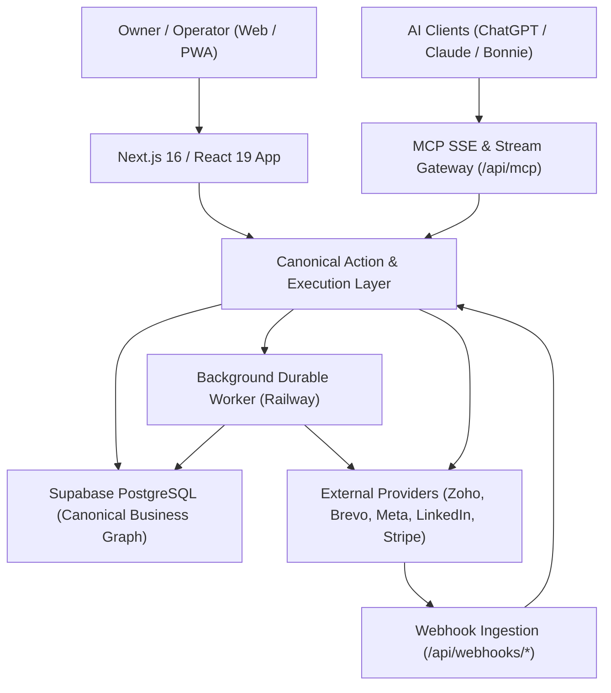

# AlphaClone Systems: Current Architecture & State of the System

**Date:** 2026-10-04  
**Audit Scope:** Full repository inspection across Frontend, Backend, APIs, MCP Gateway, Supabase DB (653 tables/views), Background Workers, Crons, and Integrations.  
**Operating Principle:** Human-led. AI-assisted. System-executed.

---

## 1. Executive Summary & Topology

AlphaClone Systems operates as a centralized business execution operating system. It coordinates operations between users, Large Language Models (ChatGPT, Claude, Bonnie AI), and external business tools (CRMs, email providers, social networks, banking, client portals).

---

## 2. Evidence-Based Module Inventory

### 2.1. CRM & Lead Discovery
- **Canonical Models:**
  - `business_clients` (668 active production records) is the canonical client table used by `businessClientService.ts` and `businessInvoiceService.ts`.
  - `contacts` (366 records) holds individual customer contact identities.
  - `leads` (1,774 records) stores scored, qualified business leads with enrichment provenance.
  - `deals` (55 records) tracks commercial pipeline stages.
- **Lead Discovery Pipeline:**
  - Multi-stage: Discovery (`src/lib/research/`) → Verification → Deduplication (`src/lib/leads/dedup.ts`) → Qualification (`src/lib/leads/qualificationBrain.ts`) → Outreach Staging.
  - LLM hallucination gates active: Contact information is validated via real HTTP and DNS probes; uncontactable records are tagged explicitly rather than dropped or fabricated.

### 2.2. Commercial Flow: Quotes & Proposals
- **Canonical Model:** `quotes` (258 records) & `quote_versions`.
- **Functionality:** Supports multi-item quotes, tax calculations, public client tokens, viewing receipts, acceptance triggers, and automatic conversion into draft/sent invoices via `convertQuoteToInvoice.ts`.

### 2.3. Legal & Contracts
- **Canonical Model:** `contracts` (92 records) & `contract_signing_tokens`.
- **Functionality:** 
  - Dual-signature workflows (internal owner + external client).
  - Server-side signing at `/api/contracts/sign` with SHA-256 audit evidence and immutable lifecycle transitions.
  - Signing links expire deterministically and are rendered without leaking developer markup or HTML internals.

### 2.4. Fulfillment: Projects & Tasks
- **Canonical Model:** `projects` (32 records) and `tasks` (3,333 records).
- **Milestones:** `project_milestones` (14 records).
- **Execution Hook:** Contract execution triggers automatic project initialization via `projectAutomationService.ts` and `contractSignedSteps.ts`.

### 2.5. Billing, Finance & Invoicing
- **Canonical Model:** `business_invoices` (61 records), `invoice_line_items`, and `business_invoice_payments` (4 records).
- **Ledger:** Double-entry journal entries and `general_ledger` materialized view.
- **Invariants:** Decimal-safe numeric amounts; overdue detection; public tokenized payment links; integration with Stripe.

### 2.6. Communications: Email Gateway
- **Canonical Model:** `email_threads` (14,936 rows), `email_messages` (14,936 rows), and `email_logs` (15,578 rows).
- **Providers:** Unified sending via `src/lib/email/sendEmailServer.ts` supporting Brevo, Zoho, Gmail, Resend, and SendGrid with automatic rate limiting, suppression checks, and bounce logging.
- **Quota Model:** Quotas are decremented only upon provider acceptance; message reading does not consume sending allowances.

### 2.7. Social Media Publishing
- **Canonical Model:** `social_posts` (459 records), `social_identities` (13 records), `social_connections` (12 records), and `social_publish_operations` (16 records).
- **Safety Enforcement:**
  - Strict destination resolution: Differentiates Personal LinkedIn profiles from Organization/Company pages (`src/lib/social/linkedinPublisher.ts`).
  - Media integrity: SHA checksum verification prevents image/video corruption. Zero placeholder substitution on failure.
  - Asynchronous container polling for Instagram media publishing.

### 2.8. AI Action Layer (MCP & Bonnie AI)
- **Tool Catalog:** 585 total tools defined across business domains (`src/lib/mcp/canonicalToolRegistry.ts`).
- **Progressive Discovery:** Full catalog with cursor pagination prevents LLM context buffer exhaustion while exposing all authorized capabilities.
- **Idempotency & Audit:** High-risk write operations are gated through `executionGateway.ts`, recording deterministic `idempotency_key` entries in `mcp_action_receipts` (194 rows) and `external_actions` (495 rows).

### 2.9. Client Portal
- **Routes:** `/portal/[token]` and `/portal-login`.
- **Capabilities:** Client 360 view giving external stakeholders authorized visibility into projects, milestones, shared contracts, documents, open and paid invoices, and communication threads.

---

## 3. Deployment, Infrastructure & Workers

- **Web Server:** Next.js 16.2 on Node 22 (hosted on Railway).
- **Database:** Supabase Managed PostgreSQL with Row Level Security, transaction-local tenant context, and custom RPC functions.
- **Shared Cache & Queue:** Redis on Railway for queue leases and deduplication.
- **Background Worker:** `src/worker/index.ts` and `src/bonnie/worker.ts` running durable tasks, event dispatches, and campaign schedules.
- **Cron Jobs:** `railway.crons.json` triggering secure webhook endpoints protected by `Bearer $CRON_SECRET`.
