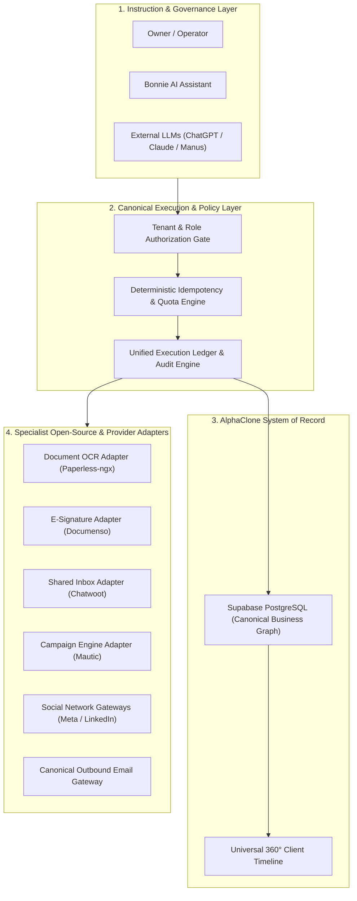

# AlphaClone Systems: Target Architecture & Systems Specification

**Status:** Target Architectural Specification  
**Guiding Vision:** "Run your business, not your tools."  
**Platform Architecture:** Human-led. AI-assisted. System-executed.

---

## 1. Architectural Philosophy & Invariants

AlphaClone is the primary operating platform and business system of record for the owner-operator. Specialist external or open-source software provides auxiliary engines (e.g., OCR, electronic signatures, customer support inboxes, marketing nurturing), but **AlphaClone retains complete ownership of customer identities, tenant isolation, permissions, execution orchestration, audit logs, and state reconciliation.**

---

## 2. Target Component Specifications

### 2.1. Canonical Execution Engine
Every action executed via UI, Bonnie AI, API routes, or MCP tools must adhere to a single execution contract:
- **Identifier:** Unique `execution_id` (UUIDv7 or crypto UUID).
- **Tenant Scope:** Mandatory non-nullable `tenant_id`.
- **Identity Context:** `actor_type` (`user` | `agent` | `system` | `cron`) and `actor_id`.
- **Target & Resource:** Scoped `module`, `entity_type`, and `entity_id`.
- **Idempotency Identity:** Deterministic `tenant_id + operation + entity_id + correlation_id` hashed with SHA-256.
- **Durable State Progression:**
  $$\text{REQUESTED} \longrightarrow \text{VALIDATED} \longrightarrow \text{QUEUED} \longrightarrow \text{PROCESSING} \longrightarrow \text{PROVIDER\_ACCEPTED} \longrightarrow \text{VERIFIED} \longrightarrow \text{COMPLETED}$$
- **Failure Recovery:** Exponential backoff with jitter, dead-letter recording, and safe manual replay.

### 2.2. Open-Source Specialist Integration Strategy

| Specialist Engine | Integration Purpose | Boundary & Ownership | Failure Mode & Fallback |
| :--- | :--- | :--- | :--- |
| **Paperless-ngx** | Deep OCR, PDF text extraction, document indexing, full-text search. | **Adapter Boundary:** Private API client. AlphaClone owns document metadata, tenant isolation, and client relationships. | If down, AlphaClone continues storing raw PDFs and rendering preview links via standard storage. |
| **Documenso** | Electronic signatures, signer certificates, legal audit trail. | **Adapter Boundary:** Webhook-driven. AlphaClone maintains the contract lifecycle, customer communication, and post-signing project spawn. | If down, internal Bonnie e-sign and contract token signing remains available. |
| **Mautic** | Marketing sequences, nurture campaigns, drip workflows. | **Adapter Boundary:** Sync adapter. AlphaClone owns contact identity, lead qualification score, and consent/suppression state. | If down, core transactional and sales outreach proceeds via AlphaClone's internal gateway. |
| **Chatwoot** | Live chat widget, multi-channel support inbox, conversation assignment. | **Adapter Boundary:** Webhook listener. AlphaClone links conversation threads to canonical `contacts` and `deals`. | If down, direct customer email threads and client portal messaging operate uninterrupted. |

---

## 3. Database Security & Tenant Isolation Standards

1. **Row Level Security (RLS):**
   - Mandatory RLS enabled across 100% of tenant-sensitive tables.
   - Elimination of naked JWT lookups in favor of cached `public.user_belongs_to_tenant(tenant_id)`.
   - All database functions must have immutable or pinned search paths (`SET search_path = pg_catalog, public, auth`).
   - Materialized views (e.g., `general_ledger`) must restrict direct `SELECT` access from `authenticated` roles and expose data exclusively through secure SECURITY DEFINER RPC functions with strict tenant membership checks.

2. **Storage Isolation:**
   - Storage paths must strictly follow `/tenant/{tenant_id}/{module}/{asset_id}`.
   - Storage proxy rejects paths outside active authenticated tenant scopes.

3. **Adversarial Negative Testing:**
   - Automated tests proving Tenant A receives `403 Forbidden` or empty result sets when attempting to query or mutate Tenant B's data via REST, RPC, MCP, or background workers.
