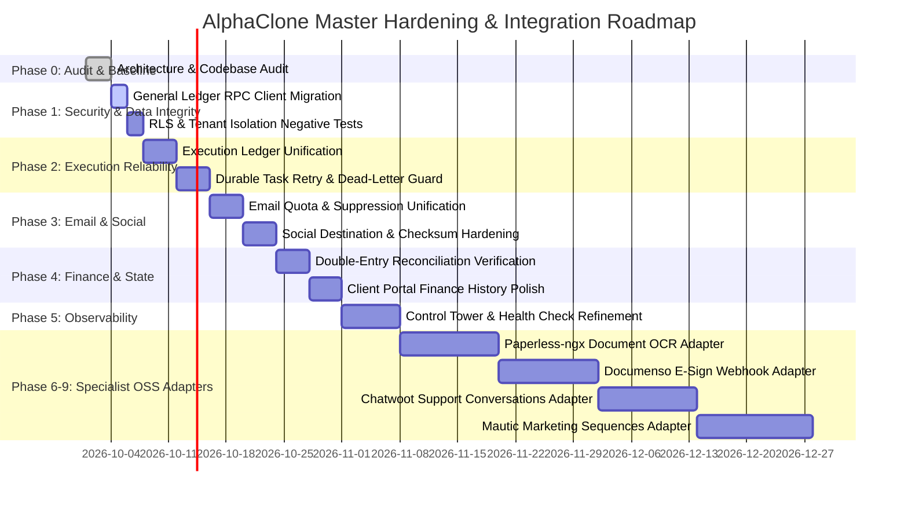

# AlphaClone Systems: Implementation Roadmap & Engineering Plan

**Version:** 1.0.0  
**Target Release Cycle:** 2026-Q4 / 2027-Q1  
**Execution Strategy:** Additive, non-destructive, phased engineering with automated verification at every milestone.

---

## 1. Roadmap Milestones & Phasing

---

## 2. Phase-by-Phase Work Packages

### Phase 1: Security and Data Integrity (Immediate Focus)
1. **General Ledger Materialized View Security:**
   - Migrate `src/services/accounting/generalLedgerService.ts` to execute `get_general_ledger_entries(tenant_id, ...)` RPC.
   - Deploy follow-up database migration to revoke direct `SELECT` on `public.general_ledger` from `authenticated`.
2. **Tenant Negative Test Suite:**
   - Create automated test verifying Tenant A cannot query or mutate Tenant B's data via Supabase REST, RPC, MCP tools, or file storage proxies.

### Phase 2: Execution Reliability & Canonical Contracts
1. **Unify High-Impact Writes:**
   - Ensure all UI manual dispatches invoke `executionGateway.ts` so `mcp_action_receipts` records an entry with a deterministic `idempotency_key`.
2. **Dead-Letter Recovery:**
   - Enhance queue worker to store complete failure payloads and provide safe, idempotent manual replay in the Control Tower.

### Phase 3: Outbound Email & Social Safety
1. **Social Destination Mismatch Guards:**
   - Enforce fail-closed verification on LinkedIn personal vs organization publishing requests.
2. **Email Quota Accounting:**
   - Guarantee that inbox reads never decrement outbound quotas, and dispatches decrement only on verified provider acceptance.

### Phase 4: Finance OS & Commercial Continuity
1. **Quote-to-Invoice & Contract-to-Project Coherence:**
   - Add additive foreign keys (`deal_id` on `quotes`, `quote_id` on `contracts`, `contract_id` on `business_invoices`).
2. **Reconciliation Automation:**
   - Automatic reconciliation between Stripe webhooks, invoice status, and general ledger journal postings.

### Phase 5: Observability & Control Tower
1. **Single Pane of Glass:**
   - Operational health dashboard monitoring Railway workers, Redis queue depth, cron execution status, and integration health without exposing secrets.

### Phases 6–9: Specialist Open-Source Integrations (Isolated Adapters)
1. **Paperless-ngx:** Private HTTP adapter for OCR text extraction and archive searching without exposing document files across tenants.
2. **Documenso:** Dedicated signing webhook adapter verifying cryptographic signatures and updating AlphaClone contract state.
3. **Chatwoot:** Customer communication sync mapping conversations to CRM contacts.
4. **Mautic:** Nurturing campaign engine honoring AlphaClone's canonical contact suppression and consent settings.

---

## 3. Definition of Done Checklist

For every work package:
- [x] Implementation uses existing canonical tables and naming conventions.
- [x] Zero destructive schema changes (no table drops, resets, or truncation).
- [x] Strict tenant isolation enforced at the database policy (RLS) layer.
- [x] 100% unit and integration test pass rate.
- [x] Full backward compatibility with existing active tenants and integrations.
